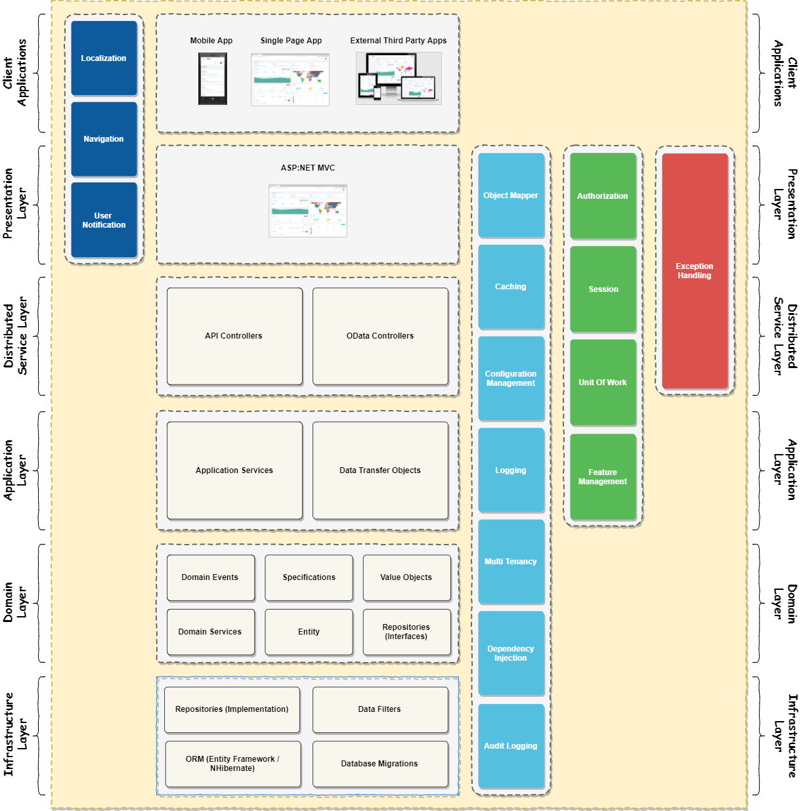

[TOC]

## 介绍

应用程序的代码库分层是一种被广泛接受的技术，有助于降低复杂性和提高代码的可重用性。ASP.NET Boilerplate 遵循领域驱动设计的原则，实现分层架构。

## 领域驱动层

领域驱动(Domain Driven Design(DDD)) 有4个基本层。

* __表示层(Presentation Layer)__ ： 提供用户操作接口(通常为软件的操作界面)。使用应用层来实现交互。

* __应用层(Application Layer)__ :  是表示层与领域层之间的中介。协调业务对象以执行特定的应用程序任务。

* __领域层(Domain Layer)__ : 包括业务对象及其规则，这是应用程序的核心。

* __基础设施层(个人倾向于数据持久层 Infrastructure Layer)__ : 提供通用技术功能，主要使用第三方库来支持更高层。

## ASP.NET Boilerplate 应用程序架构模型

除了DDD，现代架构的应用程序中还有其他逻辑和物理层。ASP.NET Boilerplate 程序建议并实施一下模型。ASP.NET  Boilerplate 通过提供基类和服务，不仅使实现此模型更容易，而且也提供了[启动模板]()来直接从这个模型开始。

### 客户端应用程序(Client Applications)

这些远程客户端通过httpapi将应用程序用作服务(API Controllers,OData Controllers),远程客户端可以是SPA(单页面应用程序)、移动应用程序或第三方消费者。[本地化](本地化.md)和[导航](导航.md)可以在这个应用程序内完成。

### 表示层(Presentation Layer)

ASP.NET [Core] MVC (Model-View-Controller) 被认为是表示层。它可以是物理层（通过httpapi使用应用程序）或逻辑层(直接注入并使用应用[程序服务](应用服务.md))。无论哪种情况，它都包含 [本地化 Localization](本地化.md)、[导航 Navigation](导航.md)、[对象映射 Object Mapping](对象映射.md)、[缓存 Caching](缓存.md)、[配置管理 Configuration Management](配置管理.md)、[审计日志 Audit Logging](审计日志.md) 等。它还需要处理[授权 Authorization](授权.md)、[会话 Session](会话.md)、[附加功能 Features](功能管理.md)以及[异常处理 Exceptiion Handling](异常处理.md)

### 分布式服务层(Distributed Service Layer)

该层用于通过远程API（如REST、OData、GraphQL等）为应用程序/域功能提供服务。它们不包含业务逻辑，只将HTTP请求转换为域交互，或者可以使用应用程序服务来委派操作。改层需要包含 [授权 Authorization](授权.md)、[缓存 Caching](缓存.md)、[审计日志 Audit Logging](审计日志.md)、[对象映射 Object Mapping](对象映射.md)、[异常处理 Exceptiion Handling](异常处理.md)、[会话 Session](会话.md)等

### 应用层(Application Layer)

应用层包含 [应用服务 Application Service](应用服务.md),而应用服务又会使用领域层以及领域对象([领域服务 Domain Sercies](领域服务.md),[实体 Entities](实体对象.md)) 来完成应用层的功能请求。 它使用 [数据传输对象 Data Transfer Object](数据传输对象.md) 来获取数据并且返回数据到表示层或者分布式服务器层。它同样需要处理 [授权 Authorization](授权.md)、[缓存 Caching](缓存.md)、[审计日志 Audit Logging](审计日志.md)、[对象映射 Object Mapping](对象映射.md)、[会话 Session](会话.md)等

### 领域层(Domain Layer)

这是实现域逻辑的主要层。 它包含 [实体 Entities](实体对象.md)、[值对象 Value Objects](值对象.md)、[领域服务 Domain Sercies](领域服务.md) 来执行业务/域逻辑。它同样包含[规范 Specifications](规范.md) 与 [领域事件 Domain Events(EventBus)](领域事件.md)。它定义了从数据源（通常是DBMS）读取和持久化实体的存储库接口。

### 基础设施层(Infrastructure Layer)

基础结构层使其他层工作：它实现存储库接口（例如使用实体框架(EF)核心）来实际处理真实的数据库，它可能包括与供应商集成以[邮件发送 Email Sending](邮件发送.md)等。这并不是所有层下面的严格层，而是通过实现其他层的抽象概念来支持其他层。
