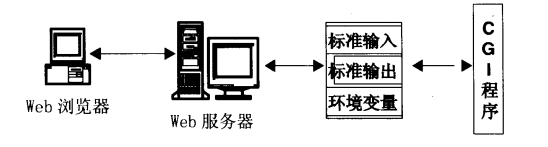

### CGI如何与Web服务器进行交互

有点类似于Linux中的管道,`ls|sort`。对于一个CGI程序来说，当CGI程序被服务器激活以后，它的标准输入是连接到Web服务器
的标准输出上,而CGI程序的标准输出则被连接到服务器的标准输入上，这就形成了完整的管道循环。

Web服务器一般将客户端传送过来的信息放在它的标准输出和相关环境变量中,而CGI程序则从环境变量和它的标准输入(也就是Web
服务器的标准输出)获取所需的信息，程序的最终输出结果则被写向它的标准输出(也就是Web服务器的标准输入)。

### Web服务器识别CGI程序

1. 当Web服务器发现客户端的请求是一个特殊目录下文件，认为该文件是一个CGI程序.通常为document root目录下的`cgi-bin`
目录,(document root目录为 /var/www/docs/  存放www资源的目录树)

2. 当Web服务器发现客户端请求是带有特殊后缀名(如:.CGI)时,就认为它是一个CGI程序.(document root目录下的 .CGI文件)

上面识别CGI程序的两种方式,取决于Web服务器本身和服务器管理员的个人习惯。大多服务器管理员都使用第一种，不推荐使用第二种方式。

### CGI 可以被取代的技术,`ISAPI`

一个`ISAPI`应用程序被某一Web网页激活后将完全驻留在内存中以等待其他客户端对它的调用,这就避免了在CGI的运行环境中为
产生并发进程所付出的额外开销，缩短了服务器的响应时间。和CGI程序不同,ISAPI应用程序和Web服务器装载在同一地址空间，
这就使得ISAPI程序不用借助于环境变量和标准输入/输出就可以和Web服务器通信。这样高性能是有条件的，所有的ISAPI程序都
必须是安全的多线程程序，而一个ISAPI程序发生错误时可能会引起整个Web服务器崩溃。ISAPI应用程序只能运行在微软的Web服
务器上或其他厂商支持ISAPI的服务器上。

[微软Aspnet_isapi.dll相关介绍](https://docs.microsoft.com/zh-cn/previous-versions/iis/6.0-sdk/ms524980(v%3dvs.90)

[查看Aspnet_isapi.dll的工具 Visual C++ Dependency Walker](http://www.dependencywalker.com/)

[Asp.net底层架构一](https://www.cnblogs.com/tmfc/archive/2006/08/29/489779.html)

[Asp.net底层架构二](https://www.cnblogs.com/tmfc/archive/2006/08/30/489816.html)

[Asp.net底层架构三](https://www.cnblogs.com/tmfc/archive/2006/08/31/490755.html)

[Asp.net底层架构四](https://www.cnblogs.com/tmfc/archive/2006/08/31/491663.html)

[Asp.net底层架构五](https://www.cnblogs.com/tmfc/archive/2006/09/01/491668.html)

[Asp.net底层架构六](https://www.cnblogs.com/tmfc/archive/2006/09/02/492938.html)

[Asp.net底层架构七](https://www.cnblogs.com/tmfc/archive/2006/09/03/493241.html)

[Asp.net底层架构八](https://www.cnblogs.com/tmfc/archive/2006/09/04/493304.html)

[Asp.net底层架构完结篇](https://www.cnblogs.com/tmfc/archive/2006/09/04/493323.html)

[Asp.net底层架构的原文地址](https://www.west-wind.com/presentations/howaspnetworks/howaspnetworks.html)

[一些关于ISAPI的书籍](isapi_bookes.md)

asp.net 站点的默认配置位置:`C:\Windows\Microsoft.NET\Framework64\v4.0.30319\Config`
