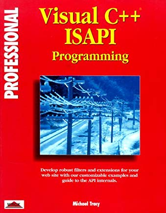
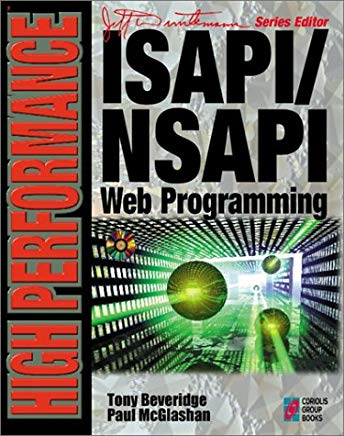
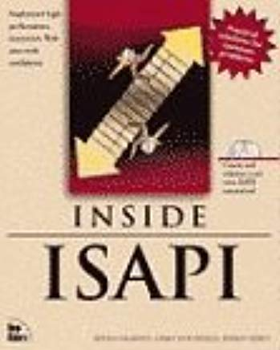
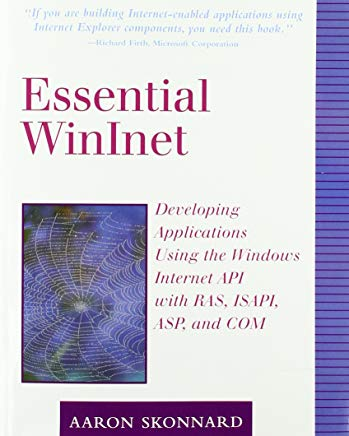
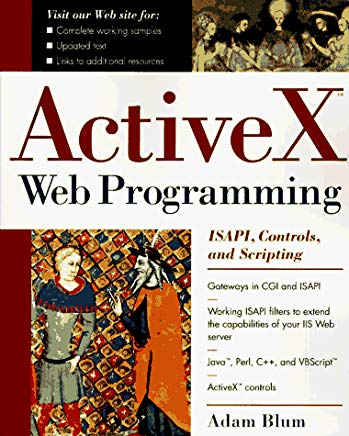

### 有关ISAPI的书籍

1. [Professional Visual C++ Isapi Programming](https://www.amazon.com/Professional-Visual-C-Isapi-Programming/dp/1874416664/ref=sr_1_1?keywords=ISAPI&qid=1553089632&s=gateway&sr=8-1)

2. [High Performance ISAPI/NSAPI Web Programming: Your Complete Guide to Creating Fast, Powerful Web Server Programs](https://www.amazon.com/High-Performance-ISAPI-NSAPI-Programming/dp/1576101517/ref=sr_1_3?keywords=ISAPI&qid=1553092383&s=books&sr=1-3)

3. [Inside Isapi](https://www.amazon.com/Inside-Isapi-Chris-Wuestefeld/dp/1562056506/ref=sr_1_4?keywords=ISAPI&qid=1553091630&s=books&sr=1-4)

4. [Essential Winlnet: Developing Applications Using the Windows Internet API with RAS, ISAPI, ASP, and COM](https://www.amazon.com/Essential-Winlnet-Developing-Applications-Internet/dp/0201379368/ref=sr_1_5?keywords=ISAPI&qid=1553089794&s=gateway&sr=8-5)

5. [ActiveX Web Programming: ISAPI, Controls, and Scripting](https://www.amazon.com/ActiveX-Web-Programming-Controls-Scripting/dp/0471161772/ref=sr_1_8?keywords=ISAPI&qid=1553089632&s=gateway&sr=8-8)

