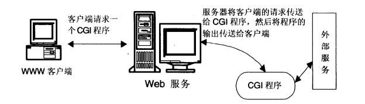

### CGI是什么,主要干哪些活

1. `CGI` 通用网关接口,是Web服务器和外部程序之间的一个接口。它的位置与作用如下图

### Web服务器如何处理请求

1. 客户端发出请求.请求的内容是一个普通的文件(如:html文件，gif或jpeg文件等),web服务器就将文件直接传送给客户端的浏览器。
如果请求的是一个CGI程序或外部应用,Web服务器将激活相应的CGI程序。

2. Web服务器激活CGI程序。CGI程序执行前，Web服务器要为该CGI程序设置一些环境变量。

3. CGI程序对客户端的请求做出反应。

4. Web服务器将CGI程序的处理结果传送给客户端

5. Web服务器中断和客户端浏览器的连接

6. Web浏览器将CGI程序的输出显示在浏览器的窗体上
