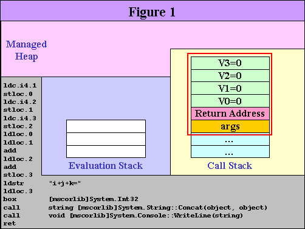
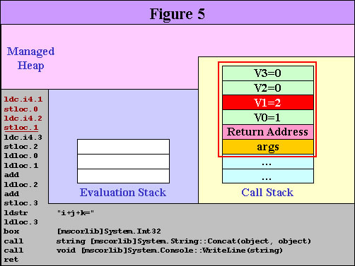
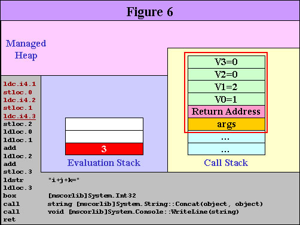
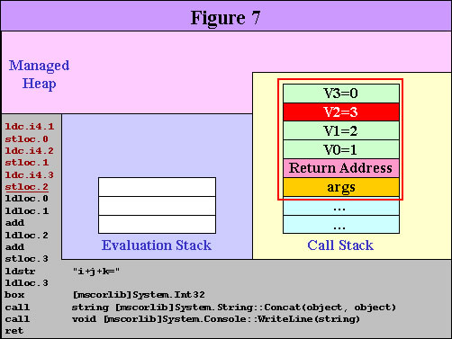
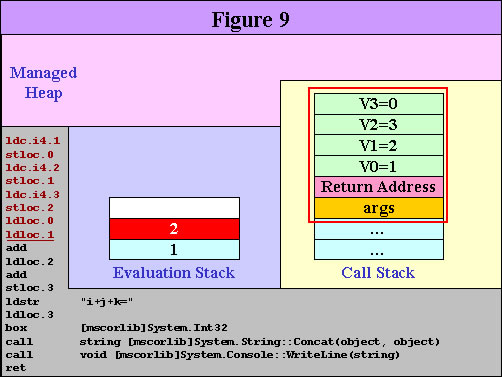
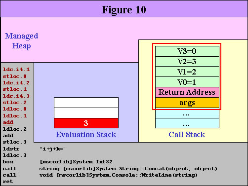
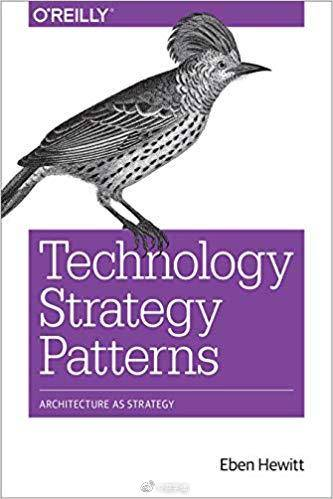
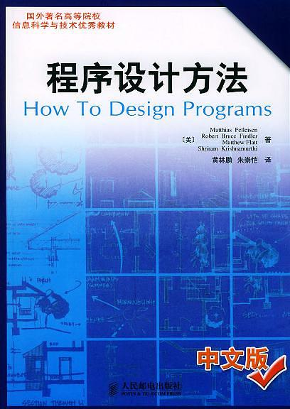
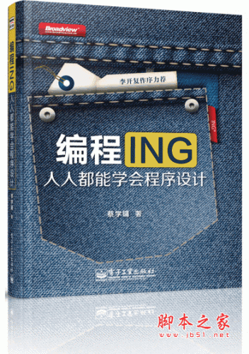
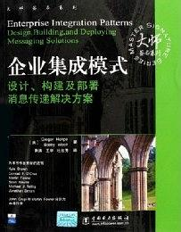

### .NET中间语言 IL

.NET CLR 和Java VM 都是堆叠式虚拟机器（Stack-Based VM），也就是说，它们的指令集（Instruction Set）都是采用堆叠运算的方式：执行时的资料都是先放在堆叠中，再进行运算。Java VM 有约200 个指令（Instruction），每个指令都是1 byte 的opcode（操作码），后面接不等数目的参数；.NET CLR 有超过220 个指令，但是有些指令使用相同的opcode，所以opcode 的数目比指令数略少。特别注意，.NET 的opcode 长度并不固定，大部分的opcode 长度是1 byte，少部分是2 byte 。

通过下面一个实例,了解堆叠式VM 的运作原理，并对.NET IL（Intermediate Language）有最基本的领略。

C# 原始代码
```
using System;
public class Test
{
    public static void Main(String[] args)
    {
        int i=1;
        int j=2;
        int k=3;
        int answer = i+j+k;
        Console.WriteLine("i+j+k="+answer);
    }
}
```

上面代码编译后得到一个 `exe`文件，用`ILDASM.EXE `来进行观察 `exe`文件的IL代码

```
ldc.i4.1
stloc.0
ldc.i4.2
stloc.1
ldc.i4.3
stloc.2
ldloc.0
ldloc.1
add
ldloc.2
add
stloc.3
ldstr      "i+j+k="
ldloc.3
box        [mscorlib]System.Int32
call       string [mscorlib]System.String::Concat(object, object)
call       void [mscorlib]System.Console::WriteLine(string)
ret
```
该程序的执行，关键的记忆体有三种分别是:

`**Managed Heap` `**`这是动态配置（Dynamic Allocation）的记忆体，由Garbage Collector（GC）在执行时自动管理，整个Process 共用一个Managed Heap

`**Call Stack`: `**` 这是由.NET CLR 在执行时自动管理的记忆体，每个Thread 都有自己专属的Call Stack。每呼叫一次method，就会使得Call Stack 上多了一个Record Frame；呼叫完毕之后，此Record Frame 会被丢弃。一般来说，Record Frame 内纪录着method 参数（Parameter）、返回位址（Return Address）、以及区域变数（Local Variable）。Java VM 和.NET CLR 都是使用0, 1, 2… 编号的方式来识别区域变数

`**Evaluation Stack` `**` 这是由.NET CLR 在执行时自动管理的记忆体，每个Thread 都有自己专属的Evaluation Stack。前面所谓的堆叠式虚拟机器，指的就是这个堆叠

1. 进入 `Main()`之后，记忆体的状况如图



2. 接着要执行第一道指令 `ldc.i4.1`,指令的意思是:在 `Evaluation Stack`置入一个4 byte的常数,其值为1。执行完此指令后,记忆体的变化如下图


3. 接着执行第二到指令`stloc.0`，指令的意思：从`Evaluation Stack`取出一个值，放到第0号变数(V0)中,这里的第0号变数其实就是原始码中的i.执行完此到指令之后,记忆体的变化如下图

 

4. 后面的第三道指令和第五道指令雷同于第一道指令,且第四道指令和第六道指令雷同于第二到指令。
第一号变量 V1 其实就是原始码中的 j,且第二号变量 V2 其实就是源码中的k。

 

 

 

 

5. 接着要执行第七道指令`ldloc.0` 以及第八道指令`ldloc.1`：分别将V0（也就是i）和V1（也就是j）的值放到Evaluation Stack，这是相加前的准备动作

 

 

6. 接着要执行第九道指令add。此指令的意思是：从Evaluation Stack 取出两个值（也就是i 和j），相加之后将结果放回Evaluation Stack 中

 


### 蔡学镛 书籍推荐











