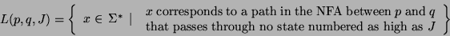
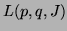

### 克林的定理

1. [原文](http://www.cs.nuim.ie/~jpower/Courses/Previous/parsing/node6.html)

我们已经展示了如何将正则表达式转换为NFA; 这些代表相同语言的证据很简单（通过归纳）。但是，我们断言两个方向都有对应关系; 这是在Kleene定理中形式化的：

K LEENE's T HEOREM，第1部分：对于每个正则表达式，对应一个NFA
策略：相应的NFA是由汤普森算法构造的; 证明它是等价的是通过对正则表达式的归纳。
证明：无聊！

K LEENE's T HEOREM，第2部分：每个NFA对应一个正则表达式
策略：通过对NFA状态的归纳证明（类型）。
NFA表示的语言可以划分为多种较小语言的并集，每种语言的定义如下：

    让NFA的状态从`1`到`N`.
    让`p`和`q`成为状态,让`J`成为一个数字,`0<=j<=N`
    

请注意，如果`S`是开始状态，则`L（S，F，N + 1)`所有完成状态的所有完成状态的`F`并集是NFA接受的语言.

同样，如果我们能够证明对所有相应的正则表达式`p`，`q`并且附加`J`，我们将证明定理。这种证明将通过归纳进行附加`J`。

证明:( Kleene定理，第2部分）
