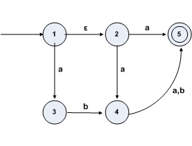
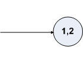
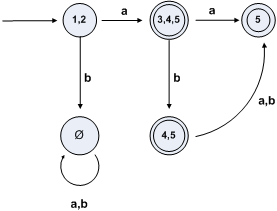

### NFA转换为DFA全过程

1. 考虑下面的`NFA`


Q = states = {1,2,3,4,5} /\*状态集合\*/
Start state: { 1 } /\*开始状态\*/
Accepting state(s): { 5 } /\*结束状态\*/

2. 现在构建等价的`DFA`

* DFA的状态被定义为NFA状态的的子状态集合
* 不好的消息是,这里有 2^5 = 32 中不同的子集合来自Q,如下
Q = states for the DFA
Some states in Q
Empty set,{1},{2},{3},{4},{5},{1,2},{1,3},...,{1,2,3,4,5}
* 但是并不是所有的将被构建的DFA状态都是可达的
* DFA开始状态应该为ε-closure
* DFA的结束状态是必须包含NFA结束状态的集合

ε-closure 状态的构建如下，它被描述为E(R)(注意:构建中的一个关键因素就是去ε)
```
 E(R) = R ∪ { q | there is an r in R with an ε transition to q }
 In the example, E({1}) = {1} ∪ {2} = {1,2}
```
3. `构建`

3.1 计算开始状态:`E({1}) = {1,2}`

3.2 开始为转换函数构建一个Table,或者画一个图带有{1,2}仅仅包含开始状态:

```
State(状态) 	      a	          b
{1,2}

```
3.3 开始通过转换函数从开始状态转换,
a.当输入为`a`的情况,考虑所有可以到达的状态，从状态{1,2}出发,

如下计算方式:
```
DFA state {1,2}
From 1, we have
         a path from 1 to 3 labeled 'a': 1 a 3
         a path from 1 to 4 labeled ε 'a': 1 ε 2 'a' 4
         a path from 1 to 5 labeled ε 'a': 1 ε 3 'a' 5
From 2, we have
         a path from 2 to 4 labeled 'a': 2 'a' 4
         a path from 2 to 5 labeled 'a': 3 'a' 5

So altogether we can reach {3,4,5} from {1,2} on input 'a'

State(状态) 	      a	          b
{1,2}            {3,4,5}
```
b.当输入为`b`的情况,考虑所有可以到达的状态，从状态{1,2}出发,然后发现为空集∅.
```
State(状态) 	      a	          b
{1,2}            {3,4,5}        ∅
```
4. 如果基于 `a`与`b` 的新的状态是可以达的，它们将为新的状态.{3,4,5} 在状态中为新的状态，它将作为新的输入状态
如下计算方式:
```
DFA state {3,4,5}, input 'a'
From 3, we have no transition paths labeled 'a'
From 4,
         a path from 4 to 5 labeled 'a': 4 a 5
From 5, there are no transition paths labeled 'a'

So altogether we can reach {5} from {3,4,5} on input 'a'

DFA state {3,4,5}, input 'b'
From state 3, a path from 3 to 4 labeled 'b': 3 b 4
From state 4, a path from 4 to 5 labeled 'b': 4 b 5
From 5, there are no transition paths labeled 'b'

So altogether we can reach {4,5} from {3,4,5} on input 'b'

State(状态) 	      a	          b
{1,2}            {3,4,5}        ∅
{3,4,5}            {5}        {4,5}
```
5. 继续上面第四步的计算,{5}和{4,5}都将是新的状态,所以挑选一个进行计算,最终的状态都是必须包含`5`的才可以算为DFA的终态
最后的结果如下
```
State(状态) 	      a	          b
{1,2}            {3,4,5}        ∅
{3,4,5}            {5}        {4,5}
{5}                 ∅           ∅
{4,5}              {5}          {5}
∅                  ∅            ∅
```
所以最后得到的转换图为

