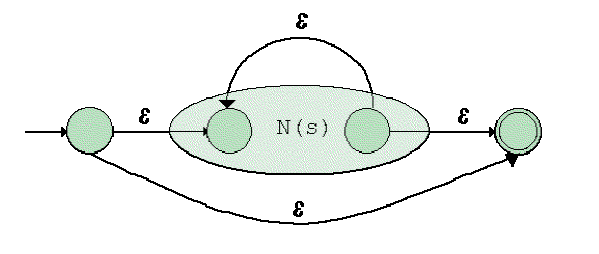

### 编译基础知识与工具

1. [在线正则表达式，转NFA 再转 DFA过程](https://cyberzhg.github.io/toolbox/nfa2dfa)

2. [正则表达式与nfa](RegularExpressionAndNFA.md)

3. [nfa转dfa过程](NFAToDFA.md)

4. [形式语言理论和解析的注记-英文版本](http://www.cs.nuim.ie/~jpower/Courses/Previous/parsing/new-main.html),[形式语言理论和解析的注记-翻译版本](FormalLanguageTheoryAndParsing/index.md)

5. [实现正则类库](../Codes/regex-nfa-dfa/RegEx_Src.zip)

### 一步一步演绎从正则表达式转换为NFA

汤普森构造法： 从正则表达式构造一个NFA
下面有几条简单的规则，他们可以从任意的正则表达式产生一个NFA

规则一： 从空集合构造NFA

规则二: 从一个字符构造NFA

规则三: 或关系,N(t) | N(s)

规则四: 且关系,N(t)N(s)

规则五: 闭包关系 S*

