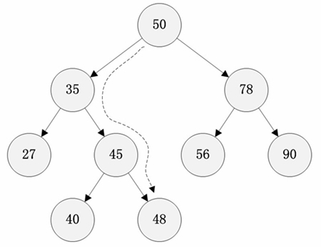
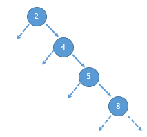
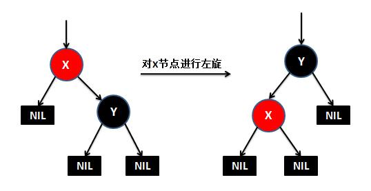
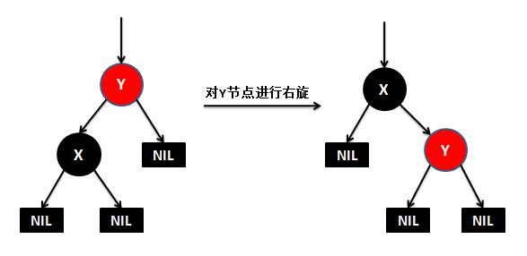

### 红黑树

1. 简单总结一下数组，链表，Hash表以及树的优缺点。
1.1.数组，优点：(1)随机访问效率高(根据下标查询)，(2)搜索效率较高(可使用折半方法)。缺点：(1)内存连续且固定，存储效率低。(2)插入和删除效率低(可能会进行数组拷贝或扩容)。
1.2.链表，优点：(1)不要求连续内存，内存利用率高，(2)插入和删除效率高(只需要改变指针指向)。缺点：(1)不支持随机访问，(2)搜索效率低(需要遍历)。
1.3.Hash表：优点：(1)搜索效率高，(2)插入和删除效率较高，缺点：(1)内存利用率低(基于数组)，(2)存在散列冲突

总结： 数组查询好、插入和删除差且浪费内存；链表插入和删除好、查询差；Hash表查询好、插入和删除也不错但是浪费内存。
也就是说，查询好的插入和删除就差，插入和删除好的查询就差，好不容易有一个查询、插入和删除都不错的，但是却又浪费内存。

2. 二叉查询树(二叉排序树,二叉搜索树),可以做到查询、插入、删除效率比较高，又不浪费内存

2.1.若左子树不空，则左子树上所有结点的值均小于它的根结点的值
2.2.若右子树不空，则右子树上所有结点的值均大于它的根结点的值
2.3.左、右子树也分别为二叉查找树
2.4.没有键值相等的节点

比如上图中如果要查找值为48的节点，只需要遍历4个节点就能完成。理论上，一颗平衡的二叉查找树的任意节点平均查找效率为树的高度h，即O(lgn)。
但是如果二叉查找树的失去平衡（元素全在一侧），搜索效率就退化为O(n)，因此二叉查找树的平衡是搜索效率的关键所在。
而`红黑树`就是靠红黑规则来维持__二叉查找树的平衡性__。

3. 红黑二叉树的特点

3.1节点是红色或黑色
3.2根节点是黑色
3.3每个叶节点（NIL节点，空节点）是黑色的
3.4每个红色节点的两个子节点都是黑色。(从每个叶子到根的所有路径上不能有两个连续的红色节点)
3.5从任一节点到其每个叶子的所有路径都包含相同数目的黑色节点

第5条规则到底是什么情况，下面简单解释下，比如图中红8到1左边的叶子节点的路径包含两个黑色节点，到6下面的叶子节点的路径也包含两个黑色节点。
但是在在添加或删除节点后，红黑树就发生了变化，可能不再满足上面的5个特性，为了保持红黑树的以上特性，就有了三个动作：左旋、右旋、着色

