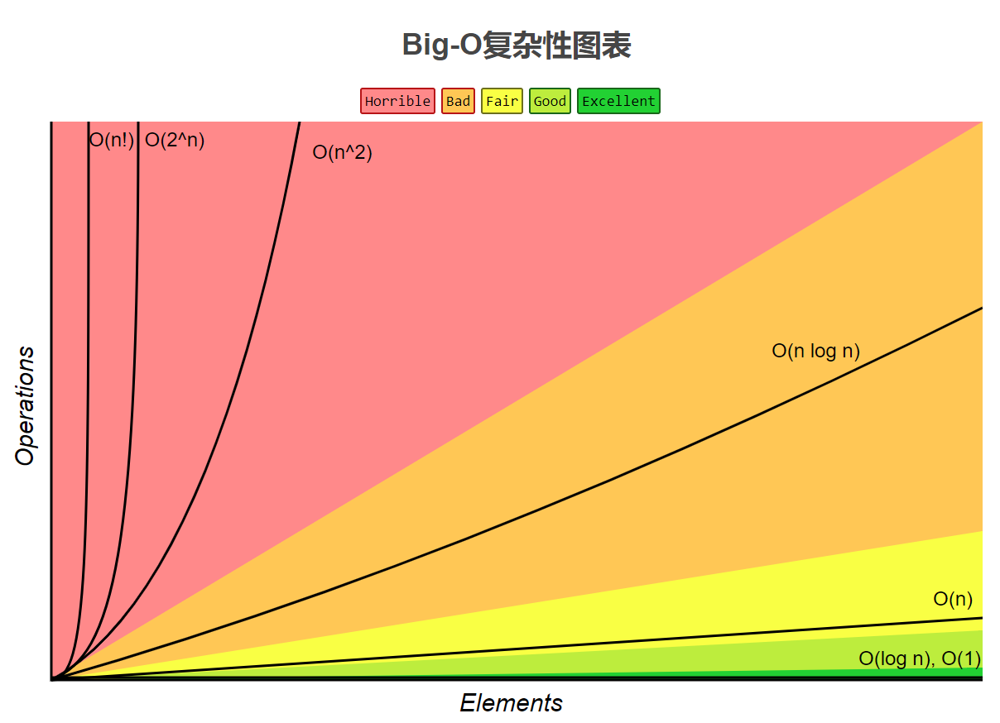
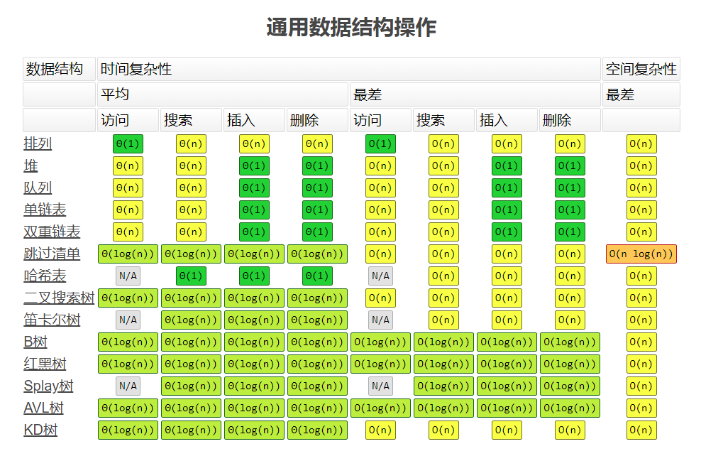
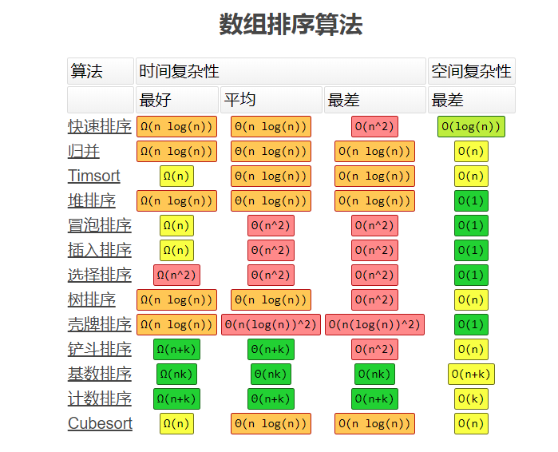

### 一些学习资料

1. [国外比较好的计算机功底教程](https://www.interviewcake.com/table-of-contents),[Javascript实现的数据结构](http://blog.benoitvallon.com/category/data-structures-in-javascript/)

2. [很多比较好的资料与书籍--来自github上的一个老程序员](https://github.com/wxyyxc1992?tab=repositories)

3. [具体的各种数据结构C#实现](https://github.com/aalhour/C-Sharp-Algorithms)

4. [国外一个学习编程的站点,数据结构比较全](https://simpledevcode.wordpress.com/category/data-structures/)

5. [github上的国外小伙子专注于各种语言的数据结构与算法](https://github.com/aalhour?utf8=%E2%9C%93&tab=repositories&q=&type=&language=python)

### 面试的算法心得

1. [面试的算法心得-01](https://wizardforcel.gitbooks.io/the-art-of-programming-by-july/content/06.07.html)

### Big-O算法复杂性图标

### 撸代码过程中碰到的一些算法与结构

1. [Topological Sort Algorithm-拓扑排序算法](TopologicalSortAlgo.md)

2. [递归调用与尾递归优化](Recursion.md)

3. [map与reduce编程模型](MapReduce.md)

4. [Filter思想](Filter.md)

5. [红黑树](TreeMap.md)

6. [KMP算法](KMP.md)

### [排序算法](https://www.cnblogs.com/surgewong/p/3379551.html)

### 算法复杂度终结图

1. [各种数据结构的算法复杂度](http://www.bigocheatsheet.com/)

### 算法实战项目(Array 与 Linked List)

1. [反转链表](https://leetcode-cn.com/problems/reverse-linked-list/)

2. [两两交换链表中的节点](https://leetcode-cn.com/problems/swap-nodes-in-pairs/)

3. [环形链表](https://leetcode-cn.com/problems/linked-list-cycle/)

4. [环形链表 II](https://leetcode-cn.com/problems/linked-list-cycle-ii/)

5. [k个一组翻转链表](https://leetcode-cn.com/problems/reverse-nodes-in-k-group/)

### 网络上一些好的算法学习经历文章

1. [我的算法学习之路](http://lucida.me/blog/on-learning-algorithms/)
