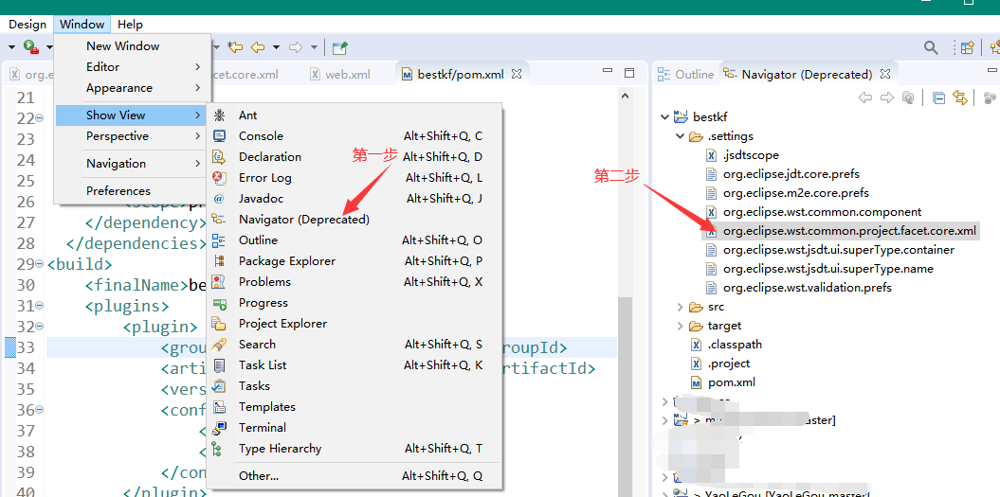
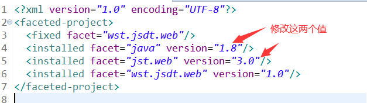

#### Maven 生成的 webapp 从 Dynamic WebModule 2.3 迁移到3.0

1. 打开视图 `Navigator` ,找到 `.settings` 下面的 `org.eclipse.wst.common.project.facet.core.xml`文件



2. 修改如下图的配置项



3. 修改 `src/main/webapp/WEB-INF/web.xml` 的具体内容为

```
<?xml version="1.0" encoding="UTF-8"?>
<web-app xmlns:xsi="http://www.w3.org/2001/XMLSchema-instance"
         xmlns="http://java.sun.com/xml/ns/javaee"
         xsi:schemaLocation="http://java.sun.com/xml/ns/javaee http://java.sun.com/xml/ns/javaee/web-app_3_0.xsd"
         id="schedule-console" version="3.0">
  <display-name>Archetype Created Web Application</display-name>
</web-app>
```

4. 修改 `pom.xml` 的build节点

```
<build>
    <finalName>bestkf</finalName>
    <plugins>  
        <plugin>  
            <groupId>org.apache.maven.plugins</groupId>  
            <artifactId>maven-compiler-plugin</artifactId>  
            <version>2.3.2</version>  
            <configuration>  
                <source>1.8</source>  
                <target>1.8</target>  
            </configuration>  
        </plugin>  
    </plugins>
  </build>
```

5. 最后进行,右键项目 `Maven`->`Update Project`
