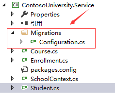

#### 入门使用

> 粗犷的CodeFirst 流程

* 安装 `EntityFramework`

```
install-package EntityFramework
```

* Visual Studio 中使用 程序包管理控制台

`PM>  get-help entityframework`，获取 EntityFramework 支持的命令

```
Enable-Migrations  //启动数据迁移
Add-Migration      //添加数据迁移
Update-Database    //将变更更新至当前开发库
Get-Migrations     //获取迁移
```

* 启动代码中加代码升级(使用代码处理)

```
var dbContext = new xxxContext();
Database.SetInitializer(new xxxxInitializer());
dbContext.Database.Initialize(true);
```

* 在 程序包管理控制台命令操作(使用命令处理)

```
enable-migrations
add-migration InitialCreate
update-database
```

> 细分在实体对象上的标记

`KeyAtrribute`,
`StringLengthAttribute`,
`RequiredAttribute`,
`MaxLengthAttribute`,
`DataTypeAtrribute`,
`DisplayAttribute`,
`concurrencyCheckAttribute`,
`TimestampAttribute`,
`ComplexTypeAttribute`,
`ColumnAttribute`,
`TableAttribute`,
`InversePropertyAttribute`,
`ForeignKeyAttribute`,
`DatabaseGeneratedAttribute`,
`NotMappedAttribute`，
`ForeignKeyAttribute`,
`DatabaseGeneratedAttribute`,
`DisplayFormatAttribute`

> 执行命令后的步骤

执行 `Enable-Migrations` 会在当前项目下生成




* 参考资料
[Entity 进行代码优先Code-First](https://www.cnblogs.com/haogj/archive/2011/04/03/2004153.html)
