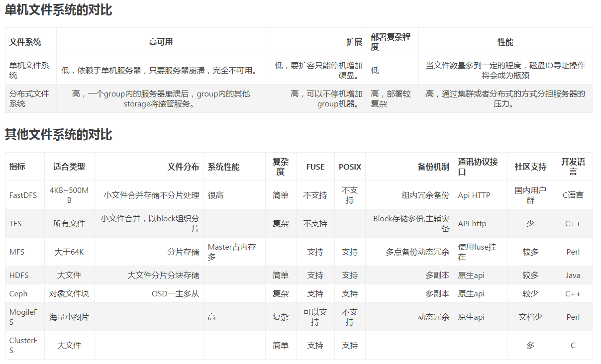
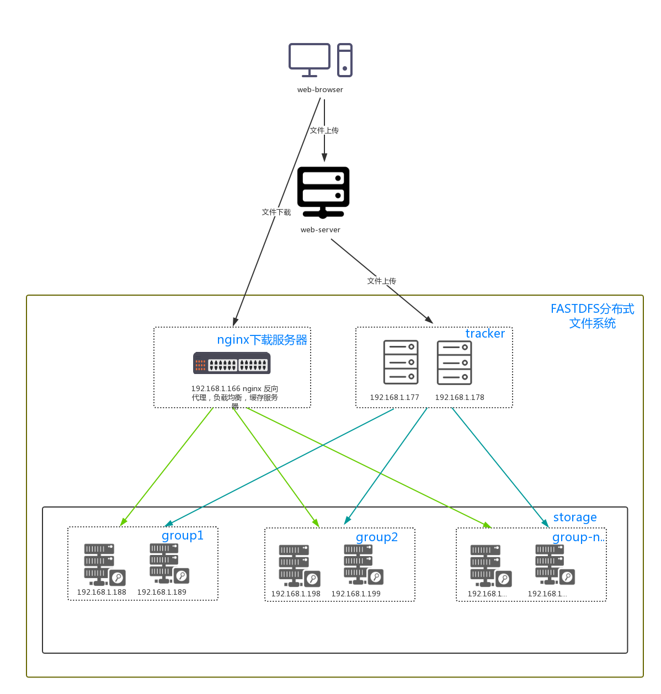

#### `FastDFS` 讲解

1. [Fastdfs简介](FastDFS介绍.ppt)

2. 与其他文件系统对比



3. 部署视图

普通公司安装


小公司安装


4. 具体安装

[Fastfds具体安装](install.md)

安装参考资料 [顺利安装的步骤](https://www.jianshu.com/p/1c71ae024e5e), [带有错误的一步步安装](https://blog.csdn.net/xiatiancc/article/details/83819062)

#### `Tracker` 配置 , `port = 22122` 与`store_group = group2 ` 与 `storage_ids_filename = storage_ids.conf`

==文件 cp /etc/fdfs/tracker.conf.sample /etc/fdfs/tracker.conf
```
# is this config file disabled
# false for enabled
# true for disabled
disabled = false

# bind an address of this host
# empty for bind all addresses of this host
bind_addr =

# the tracker server port
port = 22122

# connect timeout in seconds
# default value is 30
# Note: in the intranet network (LAN), 2 seconds is enough.
connect_timeout = 5

# network timeout in seconds for send and recv
# default value is 30
network_timeout = 60

# the base path to store data and log files
base_path = /data/fastdfs/tracker

# max concurrent connections this server support
# you should set this parameter larger, eg. 10240
# default value is 256
max_connections = 1024

# accept thread count
# default value is 1 which is recommended
# since V4.07
accept_threads = 1

# work thread count
# work threads to deal network io
# default value is 4
# since V2.00
work_threads = 4

# the min network buff size
# default value 8KB
min_buff_size = 8KB

# the max network buff size
# default value 128KB
max_buff_size = 128KB

# the method for selecting group to upload files
# 0: round robin
# 1: specify group
# 2: load balance, select the max free space group to upload file
store_lookup = 2

# which group to upload file
# when store_lookup set to 1, must set store_group to the group name
store_group = group2

# which storage server to upload file
# 0: round robin (default)
# 1: the first server order by ip address
# 2: the first server order by priority (the minimal)
# Note: if use_trunk_file set to true, must set store_server to 1 or 2
store_server = 0

# which path (means disk or mount point) of the storage server to upload file
# 0: round robin
# 2: load balance, select the max free space path to upload file
store_path = 0

# which storage server to download file
# 0: round robin (default)
# 1: the source storage server which the current file uploaded to
download_server = 0

# reserved storage space for system or other applications.
# if the free(available) space of any stoarge server in
# a group <= reserved_storage_space, no file can be uploaded to this group.
# bytes unit can be one of follows:
### G or g for gigabyte(GB)
### M or m for megabyte(MB)
### K or k for kilobyte(KB)
### no unit for byte(B)
### XX.XX% as ratio such as: reserved_storage_space = 10%
reserved_storage_space = 20%

#standard log level as syslog, case insensitive, value list:
### emerg for emergency
### alert
### crit for critical
### error
### warn for warning
### notice
### info
### debug
log_level = info

#unix group name to run this program,
#not set (empty) means run by the group of current user
run_by_group=

#unix username to run this program,
#not set (empty) means run by current user
run_by_user =

# allow_hosts can ocur more than once, host can be hostname or ip address,
# "*" (only one asterisk) means match all ip addresses
# we can use CIDR ips like 192.168.5.64/26
# and also use range like these: 10.0.1.[0-254] and host[01-08,20-25].domain.com
# for example:
# allow_hosts=10.0.1.[1-15,20]
# allow_hosts=host[01-08,20-25].domain.com
# allow_hosts=192.168.5.64/26
allow_hosts = *

# sync log buff to disk every interval seconds
# default value is 10 seconds
sync_log_buff_interval = 1

# check storage server alive interval seconds
check_active_interval = 120

# thread stack size, should >= 64KB
# default value is 256KB
thread_stack_size = 256KB

# auto adjust when the ip address of the storage server changed
# default value is true
storage_ip_changed_auto_adjust = true

# storage sync file max delay seconds
# default value is 86400 seconds (one day)
# since V2.00
storage_sync_file_max_delay = 86400

# the max time of storage sync a file
# default value is 300 seconds
# since V2.00
storage_sync_file_max_time = 300

# if use a trunk file to store several small files
# default value is false
# since V3.00
use_trunk_file = false

# the min slot size, should <= 4KB
# default value is 256 bytes
# since V3.00
slot_min_size = 256

# the max slot size, should > slot_min_size
# store the upload file to trunk file when it's size <=  this value
# default value is 16MB
# since V3.00
slot_max_size = 4MB

# the trunk file size, should >= 4MB
# default value is 64MB
# since V3.00
trunk_file_size = 64MB

# if create trunk file advancely
# default value is false
# since V3.06
trunk_create_file_advance = false

# the time base to create trunk file
# the time format: HH:MM
# default value is 02:00
# since V3.06
trunk_create_file_time_base = 02:00

# the interval of create trunk file, unit: second
# default value is 38400 (one day)
# since V3.06
trunk_create_file_interval = 86400

# the threshold to create trunk file
# when the free trunk file size less than the threshold,
# will create he trunk files
# default value is 0
# since V3.06
trunk_create_file_space_threshold = 20G

# if check trunk space occupying when loading trunk free spaces
# the occupied spaces will be ignored
# default value is false
# since V3.09
# NOTICE: set this parameter to true will slow the loading of trunk spaces
# when startup. you should set this parameter to true when neccessary.
trunk_init_check_occupying = false

# if ignore storage_trunk.dat, reload from trunk binlog
# default value is false
# since V3.10
# set to true once for version upgrade when your version less than V3.10
trunk_init_reload_from_binlog = false

# the min interval for compressing the trunk binlog file
# unit: second, 0 means never compress
# FastDFS compress the trunk binlog when trunk init and trunk destroy
# recommand to set this parameter to 86400 (one day)
# default value is 0
# since V5.01
trunk_compress_binlog_min_interval = 86400

# the interval for compressing the trunk binlog file
# unit: second, 0 means never compress
# recommand to set this parameter to 86400 (one day)
# default value is 0
# since V6.05
trunk_compress_binlog_interval = 86400

# compress the trunk binlog time base, time format: Hour:Minute
# Hour from 0 to 23, Minute from 0 to 59
# default value is 03:00
# since V6.05
trunk_compress_binlog_time_base = 03:00

# if use storage server ID instead of IP address
# if you want to use dual IPs for storage server, you MUST set
# this parameter to true, and configure the dual IPs in the file
# configured by following item "storage_ids_filename", such as storage_ids.conf
# default value is false
# since V4.00
use_storage_id = false

# specify storage ids filename, can use relative or absolute path
# this parameter is valid only when use_storage_id set to true
# since V4.00
storage_ids_filename = storage_ids.conf

# id type of the storage server in the filename, values are:
## ip: the ip address of the storage server
## id: the server id of the storage server
# this paramter is valid only when use_storage_id set to true
# default value is ip
# since V4.03
id_type_in_filename = id

# if store slave file use symbol link
# default value is false
# since V4.01
store_slave_file_use_link = false

# if rotate the error log every day
# default value is false
# since V4.02
rotate_error_log = false

# rotate error log time base, time format: Hour:Minute
# Hour from 0 to 23, Minute from 0 to 59
# default value is 00:00
# since V4.02
error_log_rotate_time = 00:00

# if compress the old error log by gzip
# default value is false
# since V6.04
compress_old_error_log = false

# compress the error log days before
# default value is 1
# since V6.04
compress_error_log_days_before = 7

# rotate error log when the log file exceeds this size
# 0 means never rotates log file by log file size
# default value is 0
# since V4.02
rotate_error_log_size = 0

# keep days of the log files
# 0 means do not delete old log files
# default value is 0
log_file_keep_days = 0

# if use connection pool
# default value is false
# since V4.05
use_connection_pool = true

# connections whose the idle time exceeds this time will be closed
# unit: second
# default value is 3600
# since V4.05
connection_pool_max_idle_time = 3600

# HTTP port on this tracker server
http.server_port = 8080

# check storage HTTP server alive interval seconds
# <= 0 for never check
# default value is 30
http.check_alive_interval = 30

# check storage HTTP server alive type, values are:
#   tcp : connect to the storge server with HTTP port only,
#        do not request and get response
#   http: storage check alive url must return http status 200
# default value is tcp
http.check_alive_type = tcp

# check storage HTTP server alive uri/url
# NOTE: storage embed HTTP server support uri: /status.html
http.check_alive_uri = /status.html
```

#### Storage 配置

```
```

### 客户端

1. [java-fastdfs-client](https://github.com/ningyu1/fastdfs-client)

2. [.net fastdfs-client](https://github.com/priceLiu/fastDFS)
