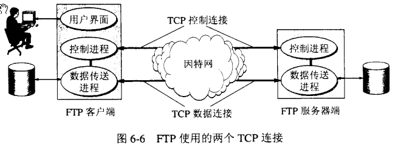
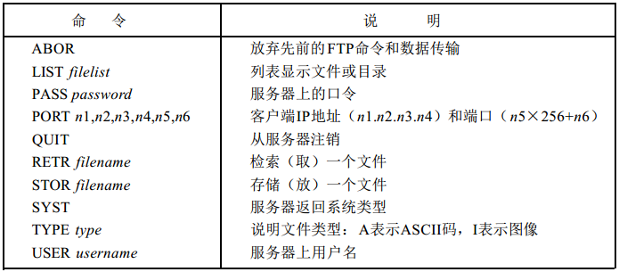
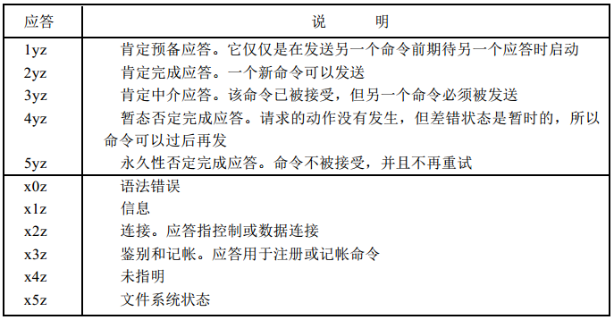
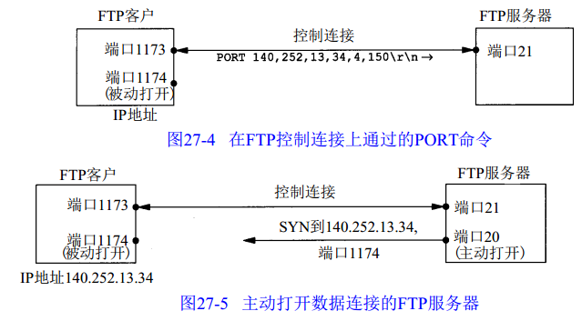

### Ftp研究

1. [FTP协议文档](RFC959_FTP传输协议.pdf),[官方协议介绍](https://tools.ietf.org/html/rfc959)

### 开源的一些Ftp项目

[客户端基础研究](https://github.com/rasm586c/SimpleFTP) ,[客户端基础研究2](https://github.com/ArxOne/FTP)

[filezilla 非常流行的FTPServer与FTPClient](https://github.com/helloworldgnu/filezilla)

1. [FubarDev.FtpServer](https://github.com/FubarDevelopment/FtpServer)

2. [FtpBox](https://github.com/FTPbox/FTPbox)

3. [FluentFTP](https://github.com/robinrodricks/FluentFTP)

4. [ArxOneFtp](https://github.com/ArxOne/FTP)

5. [CoreFTP](https://github.com/sparkeh9/CoreFTP) 没有依赖任何库

6. [sharp-ftp-server](https://github.com/rickbassham/sharp-ftp-server)

7. [Ruby--ftpd ftp sever](https://github.com/wconrad/ftpd)

8. [Go--Ftp Server](https://github.com/goftp/server)

9. [C--pure-ftpd ftp server](https://github.com/jedisct1/pure-ftpd)

10. [PHP-- PHPloy ftp server](https://github.com/banago/PHPloy)

11. [C--proftpd ftp server ](https://github.com/proftpd/proftpd)

12. [Python--pyftpdlib ftp server](https://github.com/giampaolo/pyftpdlib)

### FTP基本的工作原理

1. FTP使用客户端-服务器模型，一个FTP服务器进程可以为多个客户进程提供服务。FTP服务器有两大部分组成：一个主进程，负责接受新的请求；还有若干从属进程，负责处理单个请求。主进程工作步骤:
* 打开熟知端口(21)，使客户进程能够连接上
* 等待客户进程发送连接请求
* 启动从属进程处理客户进程发送的连接请求，从属进程处理完请求后结束，从属进程在运行期间可能根据需要可创建其他一些子进程
* 回到等待状态，继续接受其他客户进程发起的请求，主进程与从属进程的处理是并发进行的

2. FTP控制连接在整个会话期间都保持打开，只用来发送连接/传送请求。当客户进程向服务器发送连接请求时，寻找连接服务器进程的熟知端口21，同时还要告诉服务器进程自己的另一个端口号码，用于建立数据传送连接。接着，服务器进程用自己传送数据的熟知端口20与客户进程所提供的端口号码建立数据传送连接，FTP使用了2个不同的端口号，所以数据连接和控制连接不会混乱。

3. FTP数据表示

* 文件类型：ASCII码文件(默认的)/ 图像文件类型(二进制的)/ 本地文件类型(用于在具有不同字节大小主机间传送二进制数据)
* 格式控制：该选项针对ASCII类型文件适用，非打印(默认选择，文件中不包含垂直格式信息)/ 远程登录格式控制
* 结构：文件结构(默认选择，文件被认为是一个连续的字节流，不存在内部的文件结构)/ 记录结构(用于文本文件)
* 传输方式：流方式(模式选择，文件以字节流方式传输，对于文件结构，发方在文件尾提示关闭数据连接，对于记录结构，有专用的两字节序列码记录结束和文件结束)/ 块方式(文件以一系列块来传送，每块前面有一个或多个首部字节)/ 压缩方式

4. FTP命令和应答

命令和应答在客户和服务器的控制连接上以 NVT ASCII码形式传送。这就要求在每行结尾都要返回CR、 LF对（也就是每个命令或每个应答）。这些命令都是3或4个字节的大写ASCII字符，其中一些带选项参数。从客户向服务器发送的FTP命令超过30种。下图是比较常用的几种命令

应答都是A S C I I码形式的3位数字，并跟有报文选项。其原因是软件系统需要根据数字代码来决定如何应答，而选项串是面向人工处理的。由于客户通常都要输出数字应答和报文串，一个可交互的用户可以通过阅读报文串（而不必记忆所有数字回答代码的含义）来确定应答的含义。

5. FTP传送文件结束

　这个问题比较经典，也是一次面试被问到的问题。前面说过，通用传输方式是流方式，并且文件的结尾是以关闭数据连接为标志，这意味着对每一个文件传输或目录列表来说都要建立一个全新的数据连接。其一般过程如下：
* 正由于是客户发出命令要求建立数据连接，所以数据连接是在客户的控制下建立的。
* 客户通常在客户端主机上为所在数据连接端选择一个临时端口号。客户从该端口发布一个被动的打开。
* 客户使用Port命令从控制连接上把端口号发向服务器。
* 服务器在控制连接上接收端口号，并向客户端主机上的端口发布一个主动的打开。服务器的数据连接端一直使用端口20。

