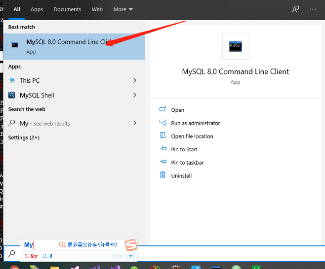

#### JFinal学习历程

1. 当出现 `Unable to load authentication plugin 'caching_sha2_password` ;使用

```
ALTER USER 'root'@'localhost' IDENTIFIED BY 'password' PASSWORD EXPIRE NEVER;
ALTER USER 'root'@'localhost' IDENTIFIED WITH mysql_native_password BY 'password';
FLUSH PRIVILEGES;
alter user 'root'@'localhost' identified by 'password';
```


