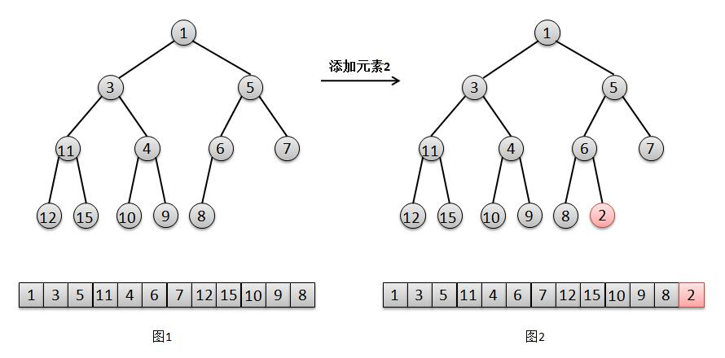
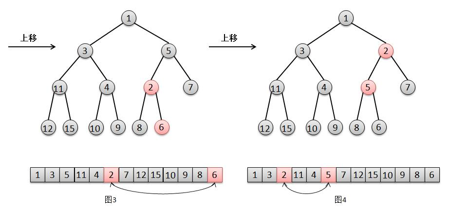
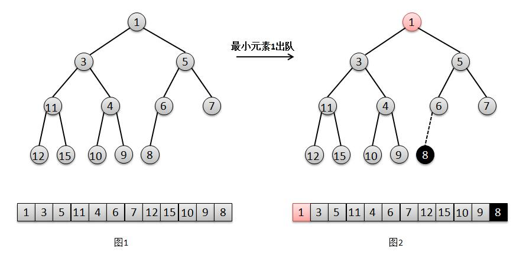
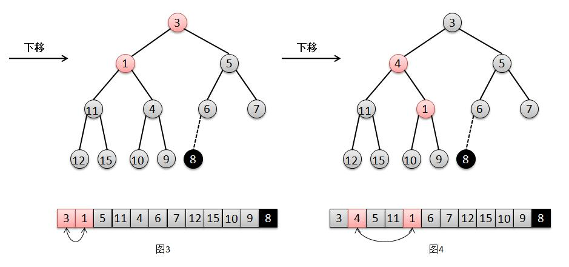
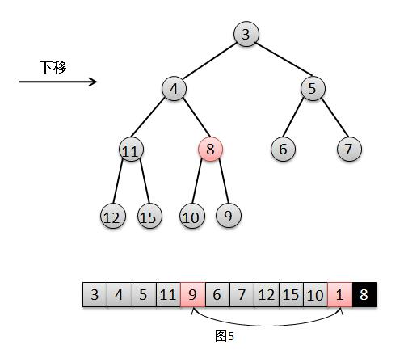

### PriorityQueue(优先队列)

1. 跟普通队列的区别在于,先进先出(First In First Out)，优先队列每次出队的元素都是优先级最高的元素

2. 二叉堆:二叉堆有两种：最大堆和最小堆.
最大堆：父结点的键值总是大于或等于任何一个子节点的键值;
最小堆：父结点的键值总是小于或等于任何一个子节点的键值.

3. 基于数组实现的二叉堆,对于数组中任意位置的n上元素,其左孩子在[2n+1]位置上,
右孩子[2(n+1)]位置,它的父亲则在[(n-1)/2]上,而根的位置则是[0]

4. 优先队列的入队规则


4.1. 将元素2添加在最后一个位置（队尾）

4.2. 由于2比其父亲6要小，所以将元素2上移，交换2和6的位置

4.3. 然后由于2比5小，继续将2上移，交换2和5的位置,此时2大于其父亲（根节点）1，结束。

5. 优先队列的出队规则


1. 将找出队尾的元素8，并将它在队尾位置上删除;

2. 此时队尾元素8比根元素1的最小孩子3要大，所以将元素1下移，交换1和3的位置;

3. 然后此时队尾元素8比元素1的最小孩子4要大，继续将1下移，交换1和4的位置;

4. 然后此时根元素8比元素1的最小孩子9要小，不需要下移，直接将根元素8赋值给此时元素1的位置，1被覆盖则相当于删除，结束。

### priorityQueue的实现代码

```
public abstract class PriorityQueue
{
	private System.Object[] heap;
	private int size;
	private int maxSize;

	public abstract bool LessThan(System.Object a, System.Object b);

	protected internal void  Initialize(int maxSize)
	{
		size = 0;
		int heapSize = maxSize + 1;
		heap = new System.Object[heapSize];
		this.maxSize = maxSize;
	}
	//添加元素都是在数组的尾部添加
	public void  Put(System.Object element)
	{
		size++;
		heap[size] = element;
		UpHeap();
	}
	//添加元素
	public virtual bool Insert(System.Object element)
	{
		if (size < maxSize)
		{
			Put(element);
			return true;
		}
		else if (size > 0 && !LessThan(element, Top()))
		{
			heap[1] = element;
			AdjustTop();
			return true;
		}
		else
			return false;
	}

	public System.Object Top()
	{
		if (size > 0)
			return heap[1];
		else
			return null;
	}
	//删除元素,都是在数组的头部删除
	public System.Object Pop()
	{
		if (size > 0)
		{
			System.Object result = heap[1]; // save first value
			heap[1] = heap[size]; // move last to first
			heap[size] = null; // permit GC of objects
			size--;
			DownHeap(); // adjust heap
			return result;
		}
		else
			return null;
	}

	public void  AdjustTop()
	{
		DownHeap();
	}

	public int Size()
	{
		return size;
	}

	public void  Clear()
	{
		for (int i = 0; i <= size; i++)
			heap[i] = null;
		size = 0;
	}

    //在堆上进行上移
	private void  UpHeap()
	{
		int i = size;
		System.Object node = heap[i]; // save bottom node
        int j = (int) (((uint) i) >> 1);
		while (j > 0 && LessThan(node, heap[j]))
		{
			heap[i] = heap[j]; // shift parents down
			i = j;
            j = (int) (((uint) j) >> 1);
		}
		heap[i] = node; // install saved node
	}
	//在堆上进行下移
	private void  DownHeap()
	{
		int i = 1;
		System.Object node = heap[i]; // save top node
		int j = i << 1; // find smaller child
		int k = j + 1;
		if (k <= size && LessThan(heap[k], heap[j]))
		{
			j = k;
		}
		while (j <= size && LessThan(heap[j], node))
		{
			heap[i] = heap[j]; // shift up child
			i = j;
			j = i << 1;
			k = j + 1;
			if (k <= size && LessThan(heap[k], heap[j]))
			{
				j = k;
			}
		}
		heap[i] = node; // install saved node
	}
}
```
