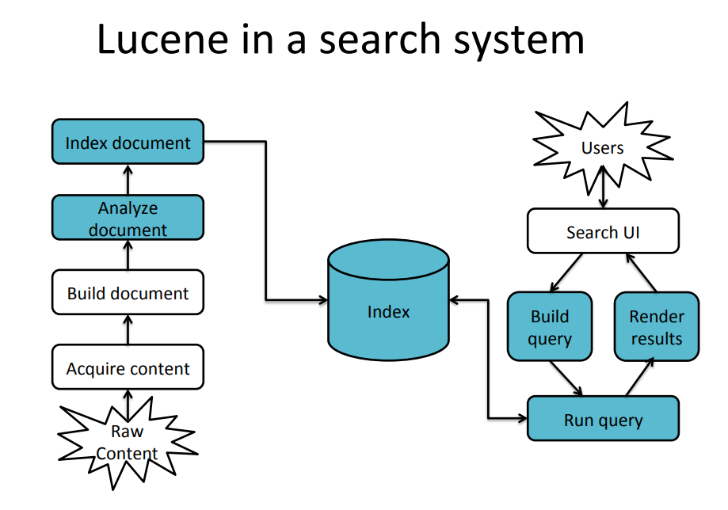
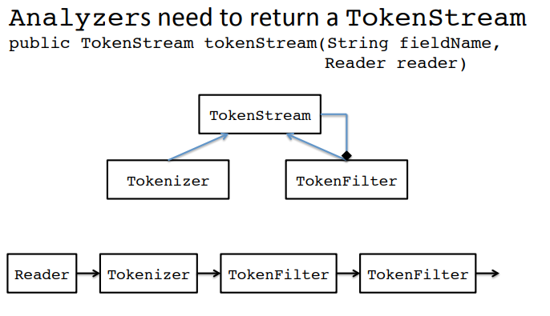
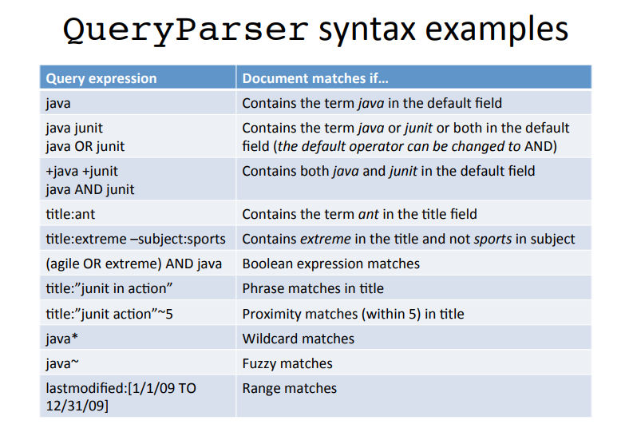

### Lucene的框架结构



[快速大家一些基本概念](builderIndexSearcher.md)

### Lucene的核心内容

1. `analysis模块` :主要负责词法分析及语言处理，也就是我们常说的分词，通过该模块可最终形成存储或者搜索的最小单元 Term
2. `index模块` : 主要负责索引的创建工作
3. `store模块` : 主要负责索引的读写，主要是对文件的一些操作，其主要目的是抽象出和平台文件系统无关的存储
4. `queryParser模块` ： 主要负责语法分析，把我们的查询语句生成 Lucene 底层可以识别的条件
5. `search模块` : 主要负责对索引的搜索工作
6. `similarity模块` : 主要负责相关性打分和排序的实现


`Term`：是索引里最小的存储和查询单元，对于英文来说一般是指一个单词，对于中文来说一般是指一个分词后的词。

`词典（Term Dictionary，也叫作字典）`：是 Term 的集合。词典的数据结构可以有很多种，每种都有自己的优缺点。比如：排序数组通过二分查找来检索数据：HashMap（哈希表）比排序数组的检索速度更快，但是会浪费存储空间。
FST(finite-state transducer)有更高的数据压缩率和查询效率，因为词典是常驻内存的，而 FST 有很好的压缩率，所以 FST 在 Lucene 的最新版本中有非常多的使用场景，也是默认的词典数据结构

`倒排序(Posting List)`：一篇文章通常由多个词组成，倒排表记录的是某个词在哪些文章中出现过

`正向信息`：原始的文档信息，可以用来做排序、聚合、展示等

`段(Segment)`：索引中最小的独立存储单元。一个索引文件由一个或者多个段组成。在 Luence 中的段有不变性，也就是说段一旦生成，在其上只能有读操作，不能有写操作

#### 创建索引需要的类
1. `IndexWriter` :

1.1 Index format(索引格式化)
1.1.1 Each Lucene index consists of one or more segments
   --A segment is a standalone index for a subset(子集) of documents
   --All segments are searched
   --A segement is created whenever IndexWriter flushes adds/deletes
1.1.2 Periodically,IndexWriter will merge a set of segments into a single segment
   --Policy specified by a MergePolicy
1.1.3 You can explicitly invoke optimize() to merge segments

1.2 Basic merge policy
1.2.1 Segments are grouped into levels
1.2.2 Segments within a group are roughly equal size(in log space)
1.2.3 Once a level has enough segments,they are merged into a segment at the next level up

2. `Directory` :
3. `Analyzer`: Tokenizes the input text.Need to ensure that Analyzers used at indexing time are consistent with Analyzers used at searching time.(建立索引与查询索引的时候，需要分析器保持一致)

3.1 WhitespaceAnalyzer : Splits tokens on Whitespace
3.2 SimpleAnalyzer : Splits tokens on non-letters,and then lowercases
3.3 StopAnalyzer : Same as SimpleAnalyzer,but also removes stop words
3.4 StandardAnalyzer : Most sophisticated analyzer that knows about certain token types,lowercases,removes stop words


4. `Document`: A Document is the atomic(原子的) unit of indexing and searching，A Document contains Fields.

5. `Field`: Fields have a name and a value.

5.1 You have to translate raw content into Fields
5.2 Examples: Title,author,date,abstract,body,URL,keywords,...
5.3 Different documents can have different Fields
5.4 Search a field using name:term ,eg:title:lucene

6. `Fields`

6.1 Be indexed or not
6.2 Be stored or not
6.3 Optionally store term vectors. Like an inverted index on the Field's terms;Useful for highlighting ,finding similar documents

#### 索引查询需要的类

1. `IndexSearcher`

1.1 Constructor:
1.1.1 --IndexSearch(Directory d); __deprecated__
1.1.2 --IndexSearcher(IndexReader r);Construct an IndexReader with static method IndexReader.open(dir)

1.2 Methods
1.2.1 --TopDocs search(Query q,int n);
1.2.2 --Document doc(int docID);

2. `Query`

2.1 Query的种类

TermQuery ; TermRangeQuery ; NumericRangeQuery ; PrefixQuery ; BooleanQuery ;
PhraseQuery ; WildcardQuery ; FuzzyQuery ; MatchAllDocsQuery

3. `QueryParser`

1.1 Constructor:
1.1.1 --QueryParser(Version matchVersion,string defaultField,Analyzer analyzer);

1.2 Parsing methods
1.2.1 --Query parse(string query) throws ParseException;
1.2.2 -- ...and many more

1.3 QueryParser的语法


4. `TopDocs`

4.1 TopDocs methods
4.1.1 --Number of documents that matched the search totalHits
4.1.2 --Array of ScoreDoc instances containing results ScoreDocs
4.1.3 --Returns best score of all matches getMaxScore()

5. `ScoreDoc`

5.1 ScoreDoc methods
5.1.1 Document id doc
5.1.2 Document score score

### 当索引有所改变的时候(Searching a changing index)

```
Directory dir = FSDirectory.open(...);
IndexReader reader = IndexReader.open(dir);
IndexSearcher searcher = new IndexSearcher(reder);

//Above reader does not reflect changes to the index unless you reopen it.
//Reopening is more resource efficient than opening a new IndexReader.

IndexReader newReader = reader.reopen();
if(reader != newReader){
  reader.close();
  reader = newreader;
  searcher = new IndexSearcher(reader);
}
```
### 实时查询(Near-real-time search)

```
IndexWriter writer = ....;
IndexReader reader = writer.getReader();
IndexSearcher searcher = new IndexSearcher(reader);
//Now let us say there's change to the index using IndexWriter
//reopne() and getReader() force writer to flush
IndexReader newReader = reader.reopen();
if(reader != newReader ){
  reader.close();
  reader = newReader;
  searcher = new IndexSearcher(reader);
}
```

### 阅读Lucene.net源代码

1. `BitVector.cs` [代码分析](BitVector.md)

2. `PriorityQueue` [代码分析](PriorityQueue.md)

### Luncene.net的不错资料

1. [Lucene.net的基本使用](https://blog.csdn.net/huwei2003/article/details/53410335)

2. [底层数据结构与原理讲解](https://blog.csdn.net/njpjsoftdev/article/details/54015485)
