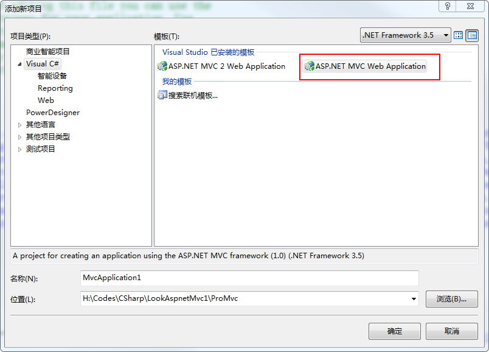
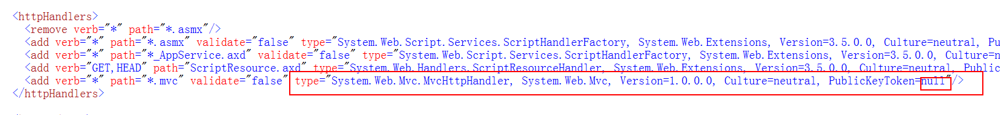
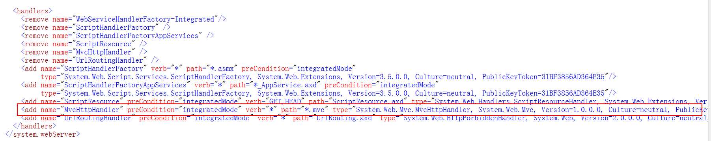
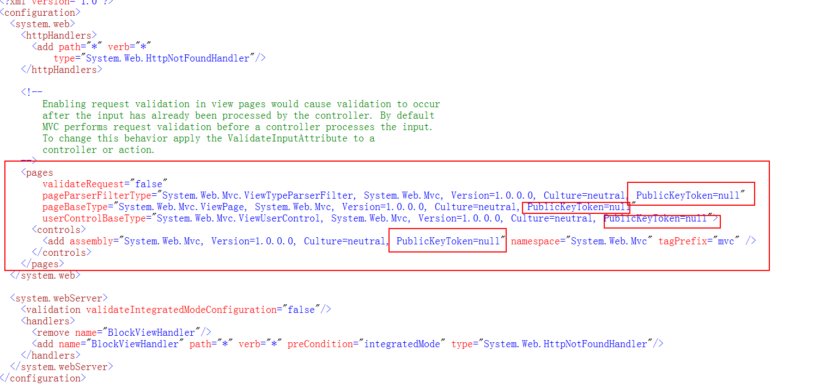

### `asp.net MVC1`调试

1. 调试环境配置,`Visual Studio 2008`,[AspNetMVC1.msi](AspNetMVC1.zip),[Mvc源码框架](AspNetMvc1.0.Ms-PL.source.zip)
这里有个更多未来mvc1的[mvc框架扩展源码](MVC-RTM.zip)

2. 搭建MVC1的站点

2.1 创建Web项目

2.2 修改根目录下面的`web.config`

2.3 修改View目录下的`web.config`

