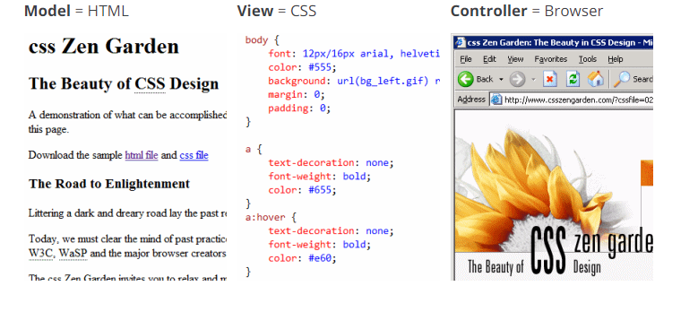
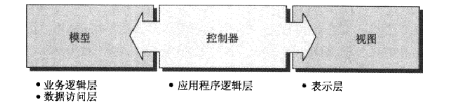

### MVC 模型

1. 非常形象的`MVC`模型，[国外友人对mvc的理解](https://blog.codinghorror.com/understanding-model-view-controller/)

2. 微软对MVC的定义

`模型` 通过域对象，结合默写业务逻辑存储和操作数据库状态的类

`视图` 用户界面部分,采用HTML编码，用于将模型呈现给用户。如果需要使用Javascript编程的话,也可以将模型呈现为xml或json

`控制器` 接受输入并通过模型将信息保存到数据库的应用程序层。其中也包含少量用于控制和验证输入的业务逻辑。控制器还可以决定呈现哪个
视图，并且可以根据浏览器请求的呈现形式，以Html、XML、Json形式呈现视图

3. 一般使用MVC进行站点设计的划分

4. 网友对[MVC1.0的讲解](https://www.cnblogs.com/jsdjt/articles/1431685.html)
