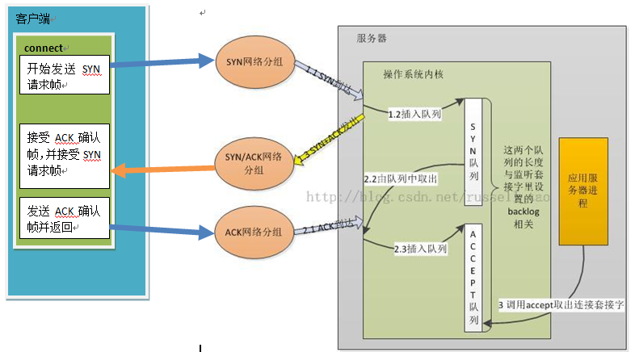
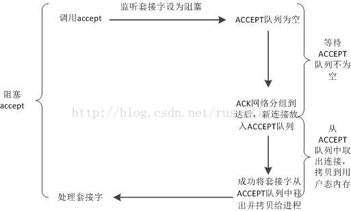
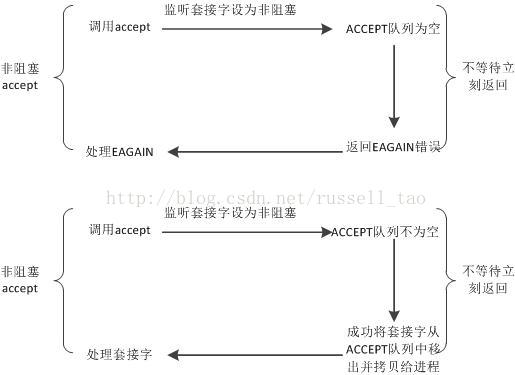

### Listen,Accept,Connect的流程及原理

1. 服务器端在调用listen之后，内核会建立两个队列，SYN队列和ACCEPT队列，其中ACCPET队列的长度由backlog指定。
2. 服务器端在调用accpet之后，将阻塞，等待ACCPT队列有元素。
3. 客户端在调用connect之后，将开始发起SYN请求，请求与服务器建立连接，此时称为第一次握手。
4. 服务器端在接受到SYN请求之后，把请求方放入SYN队列中，并给客户端回复一个确认帧ACK，此帧还会携带一个请求与客户端建立连接的请求标志，也就是SYN，这称为第二次握手
5. 客户端收到SYN+ACK帧后，connect返回，并发送确认建立连接帧ACK给服务器端。这称为第三次握手
6. 服务器端收到ACK帧后，会把请求方从SYN队列中移出，放至ACCEPT队列中，而accept函数也等到了自己的资源，从阻塞中唤醒，从ACCEPT队列中取出请求方，重新建立一个新的sockfd，并返回。

现有我们可以来讨论应用层组件：为何有的应用服务器进程中，会单独使用1个线程，只调用accept方法来建立连接，例如tomcat；有的应用服务器进程中，却用1个线程做所有的事，包括accept获取新连接。

原因在于：首先，SYN队列和ACCEPT队列都不是无限长度的，它们的长度限制与调用listen监听某个地址端口时传递的backlog参数有关。既然队列长度是一个值，那么，队列会满吗？当然会，如果上图中第1步执行的速度大于第2步执行的速度，SYN队列就会不断增大直到队列满；如果第2步执行的速度远大于第3步执行的速度，ACCEPT队列同样会达到上限。第1、2步不是应用程序可控的，但第3步却是应用程序的行为，假设进程中调用accept获取新连接的代码段长期得不到执行，例如获取不到锁、IO阻塞等。

那么，这两个队列满了后，新的请求到达了又将发生什么？
若SYN队列满，则会直接丢弃请求，即新的SYN网络分组会被丢弃；如果ACCEPT队列满，则不会导致放弃连接，也不会把连接从SYN列队中移出，这会加剧SYN队列的增长。所以，对应用服务器来说，如果ACCEPT队列中有已经建立好的TCP连接，却没有及时的把它取出来，这样，一旦导致两个队列满了后，就会使客户端不能再建立新连接，引发严重问题。
所以，如TOMCAT等服务器会使用独立的线程，只做accept获取连接这一件事，以防止不能及时的去accept获取连接。

那么，为什么如Nginx等一些服务器，在一个线程内做accept的同时，还会做其他IO等操作呢？
这里就带出阻塞和非阻塞的概念。应用程序可以把listen时设置的套接字设为非阻塞模式（默认为阻塞模式），这两种模式会导致accept方法有不同的行为。对阻塞套接字，accept行为如下图：

这幅图中可以看到，阻塞套接字上使用accept，第一个阶段是等待ACCEPT队列不为空的阶段，它耗时不定，由客户端是否向自己发起了TCP请求而定，可能会耗时很长。对非阻塞套接字，accept会有两种返回，如下图：

所以，企业级的服务器进程中，若某一线程既使用accept获取新连接，又继续在这个连接上读、写字符流，那么，这个连接对应的套接字通常要设为非阻塞。原因如上图，调用accept时不会长期占用所属线程的CPU时间片，使得线程能够及时的做其他工作。

推荐读书:[深入理解nginx:模块开发与架构解析](http://product.china-pub.com/4918661)
