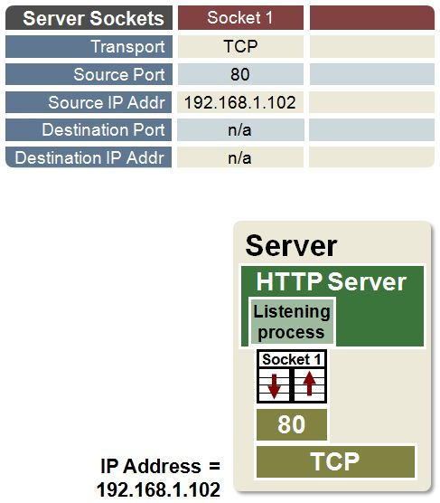
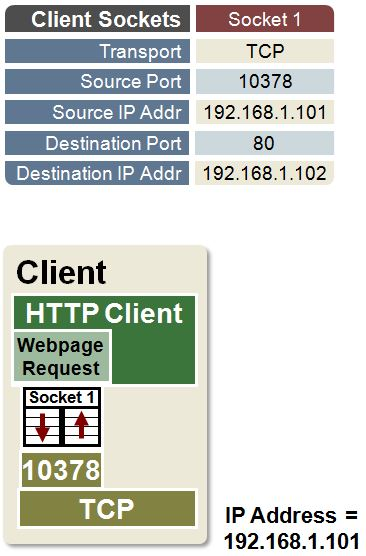
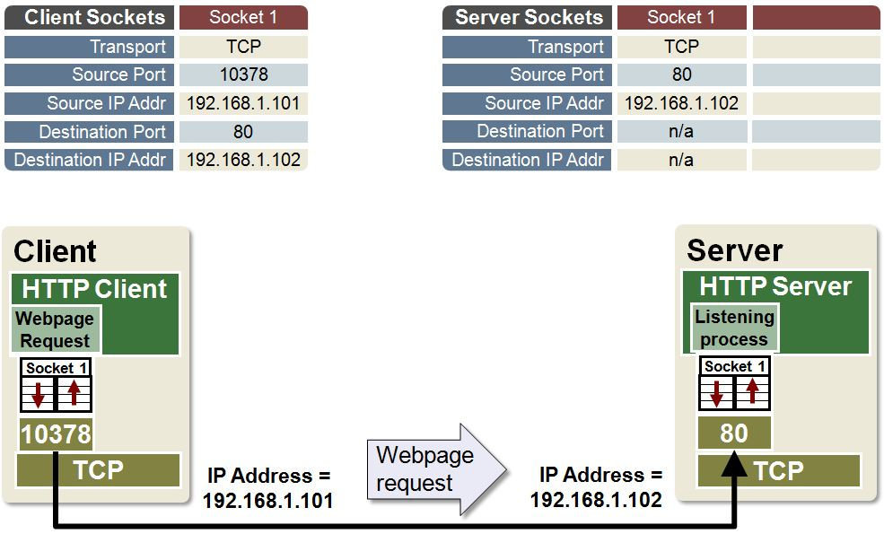
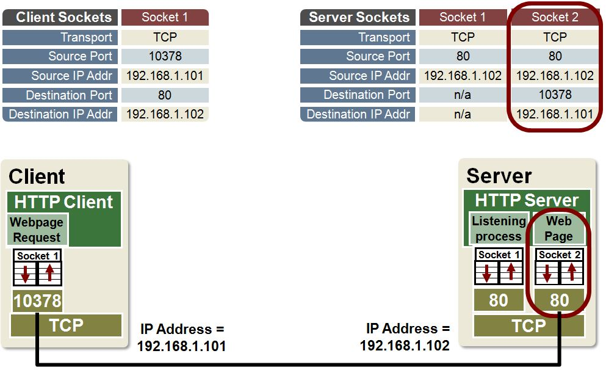
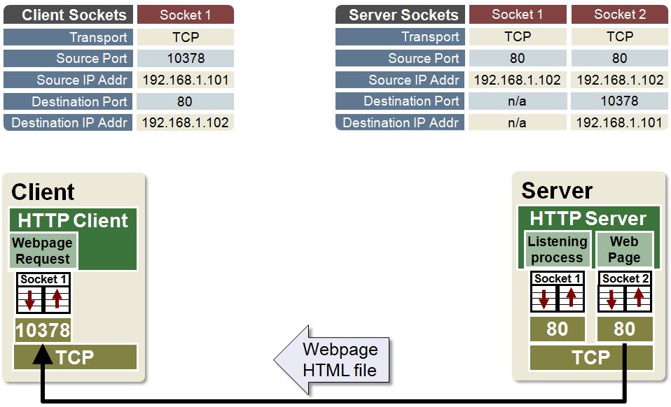
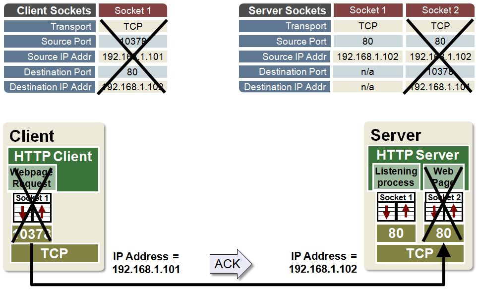

### 使用套接字创建TCP连接

1. 服务器创建套接字并且侦听

Web服务器创建专用于侦听客户端请求的套接字，套接字存在后，服务器进入'侦听'模式并等待客户端的请求。
它会定期检查此套接字中收到的信息。这种类型的套接字称为无连接套接字，无连接套接字用于与Http服务器建立Tcp连接。
没有为此类型的套接字定义目标IP地址或端口号。

2. 客户端创建套接字并且连接

当客户端想要下载网页时,它会创建一个套接字然后将网页下载请求发送到套接字。

3. 传输层向服务器发送消息

客户端的传输层定期检查其传输缓冲区,以确定是否需要发送消息。找到消息后,它将转发到目标地址。

4. 服务器创建套接字和进程

当服务器收到客户端的请求时，它会创建一个新的专用套接字和进程。然后它为客户端创建一条信息并将其发送到套接字。
请注意，此套接字使用客户端的目标IP地址和端口号。此虚拟TCP连接现在称为"已建立"。

5. 传输层向客户端发送消息

服务器的传输层定期检查其传输缓冲区，以确定是否需要发送消息。
找到消息后，它将转发到目标地址。

6. 套接字关闭

客户端收到它请求的网页后，会向服务器发送确认，然后关闭其套接字。
服务端接受客户端的确认，然后关闭其套接字。

7. [微软官方实际的例子](https://docs.microsoft.com/en-us/dotnet/api/system.net.sockets.socketasynceventargs?redirectedfrom=MSDN&view=netframework-4.5.2) ;
[codeproject上的例子](https://www.codeproject.com/Articles/83102/C-SocketAsyncEventArgs-High-Performance-Socket-Cod)
