###  MVC 认证与授权

#### 认证

__创建一个Web Application__

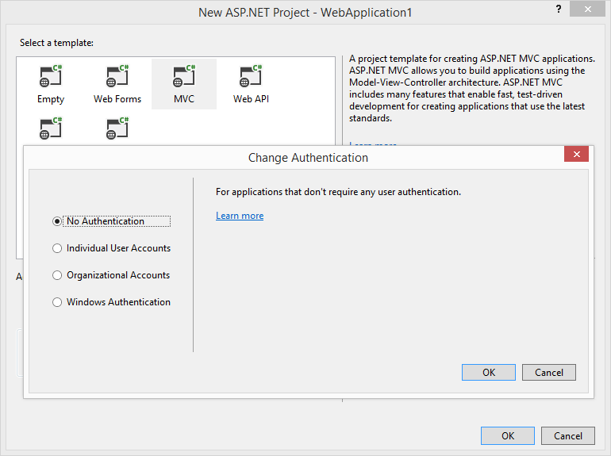

右键 `Web Application`项目,在属性上选择

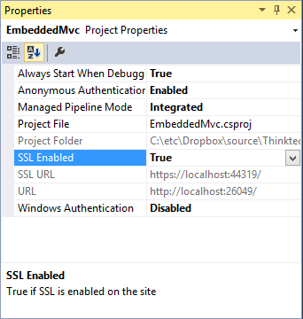

`别忘记更新启动的Url地址`


__添加 IdentityServer__

IdentityServer 是基于 Owin/Katana，添加它们到新的 WebApplication项目中
```
install-package Microsoft.Owin.Host.Systemweb
install-package IdenityServer3
```

__配置 IdentityServer 客户端__

IdentityServer需要客户端的一些信息支持，可以简单的使用 `Client` 对象提供支持。

```
public static class Clients
{
  public static IEnumerable<Client> Get()
  {
    return new[]
    {
      new Client
      {
        Enabled = true,
        ClientName = "MVC Client",
        ClientId = "mvc",
        Flow = Flows.Implicit,

        RedirectUris = new List<string>
        {
          "https://localhost:44319/"
        },

        AllowAccessToAllScopes = true
      }
    }
  }
}
```

`备注` 现在客户端可以访问所有作用域(通过对 `AllowAccessToAllScopes`的设置),对于生产应用程序，您可以将其锁定，稍后再谈

__配置 IdentityServer 用户__

接下来，我们将向 `IdentityServer` 添加一些用户，同样这可以用一个简单的类来进行实现。您可以从任何数据存储中检索用户信息，我们提供了对Asp.net Identity 与 MembershipReboot的支持

```
public static class Users
{
  public static List<InMemoryUser> Get()
  {
    return new List<InMemoryUser>
    {
      new InMemoryUser
      {
        Username = "bob",
        Password = "secret",
        Subject = "1",

        Claims = new []
        {
          new Claim(Constants.ClaimTypes.GivenName,"Bob"),
          new Claim(Constants.ClaimTypes.FamilyName,"Smith")
        }
      }
    }
  }
}
```

__添加启动 Startup__

在 Startup类中配置 IdentityServer,在这里，我们提供有关客户端、用户、作用域、签名证书和一些其他配置选项的信息。在生产中，您应该从Windows证书存储活其他安全源加载签名证书。在这个示例中，我们只是将其作为文件添加到项目中，[下载证书](https://github.com/IdentityServer/IdentityServer3.Samples/tree/master/source/Certificates),将其添加到项目中，并将其生成操作设置为 “复制到输出”

```
public clsss Startup
{
  public void Configuration(IAppBuilder app)
  {
    app.Map("/identity",idsrvApp=>{
      idsrvApp.UseIdentityServer(new IdentityServerOptions
        {
          SiteName = "Embedded IdentityServer",
          SigningCertificate = LoadCertificate(),

          Factory = new IdentityServerServiceFactory()
                    .UseInMemoryUser(Users.Get())
                    .UseInMemoryClients(Clients.Get())
                    .UseInMemoryScopes(StandardScopes.All)
        });
    });
  }

  X509Certificate2 LoadCertificate()
  {
    return new X509Certificate2(
        string.Format(@"{0}\bin\identityServer\idesrv3test.pfx",AppDomain.CurrentDomain.BaseDirectory),"idsrv3test"
      );
  }
}
```
此时，您有一个功能齐全的IdentityServer,您可以浏览到发现终节点以检查配置
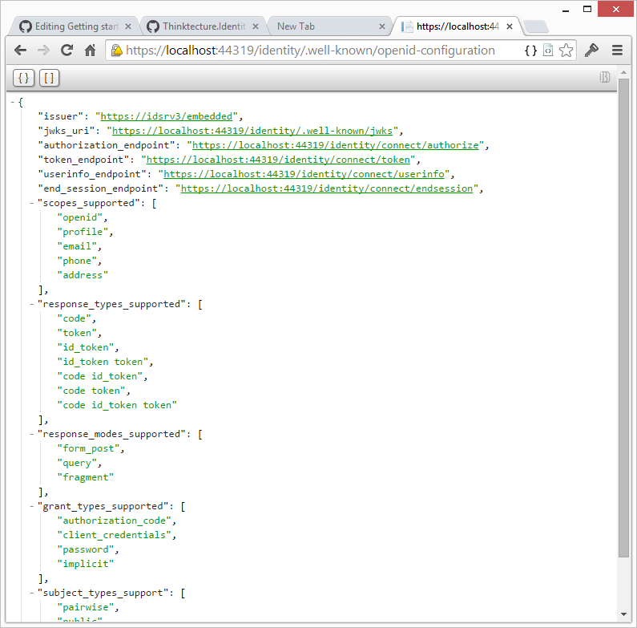

最后一件事，请不要忘记修改 `web.config`,如果不调整，某些嵌入式资源无法被加载
```
<system.webServer>
  <modules runAllManagedModulesForAllRequests="true" />
</system.webServer>
```

__添加并且配置 OpenID Connect 认证中间件__

MVC application 项目中添加 OIDC 认证功能，我们需要2个包

```
install-package Microsoft.Owin.Security.Cookies
install-package Microsoft.Owin.Security.OpenIdConnect
```

在 `StartUp.cs`中配置 cookie中间件
```
app.UseCookieAuthentication(new CookieAuthenticationOptions{
    AuthenticationType = "Cookies"
  });
```

将 OpenID Connect 中间件也添加到 `StartUp.cs`中，指向我们的嵌入式版本IdentityServer,并使用先前配置的客户端配置

```
app.UseOpenIdConnectAuthentication(new OpenIdConnectAuthenticationOptions{
    Authority = "https://localhost:44319/identity",
    ClientId = "mvc",
    RedirectUri = "https://localhost:44319/",
    ResponseType = "id_token",

    SignInAsAuthenticationType = "Cookies"
  });
```

__添加一个保护资源并且显示声明__

要使用IdentityServer启动身份验证，您需要创建受保护的资源，例如通过添加全局授权筛选器。对于我们的示例，我们将简单地保护主控制器上的About操作。此外，我们将把声明交给视图，这样我们就可以看到IdentityServer发出了哪些声明：
```
[Authorize]
public ActionResult About()
{
  return View((User as ClaimsPrincipal).Claims);
}
```
相应的视图如下
```
@model IEnumerable<System.Security.Claims.Claim>

<dl>
    @foreach (var claim in Model)
    {
        <dt>@claim.Type</dt>
        <dd>@claim.Value</dd>
    }
</dl>
```

__认证与声明__

点击about链接将触发身份验证。IdentityServer将显示登录屏幕并将令牌发送回主应用程序。OpenID连接中间件验证令牌，提取声明并将其传递给cookie中间件，后者将依次设置身份验证cookie。用户现在已登录。

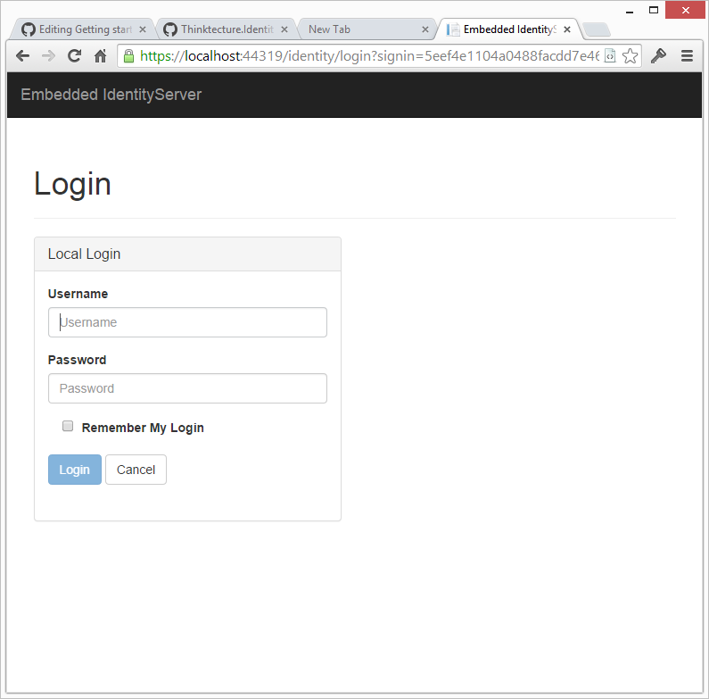

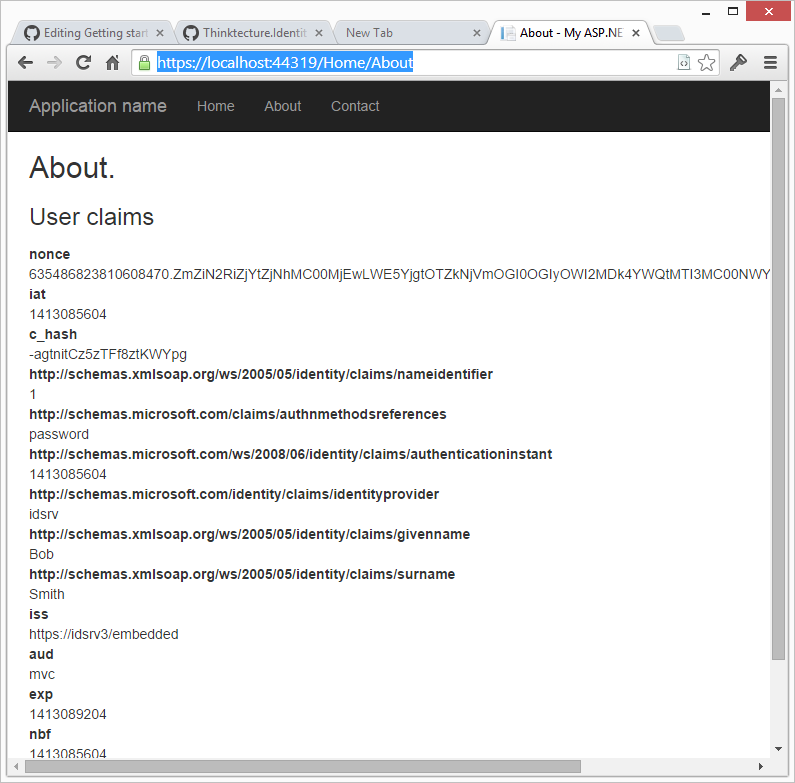

__添加角色声明与Scope__

在下一步中，我们希望向用户添加一些角色声明，稍后我们将使用这些声明进行授权。
现在，我们不再讨论OIDC 标准作用域了，让我们定义一个包含角色声明的角色作用域，并将其添加到标准作用域中

```
public static class Scopes
{
    public static IEnumerable<Scope> Get()
    {
        var scopes = new List<Scope>
        {
            new Scope
            {
                Enabled = true,
                Name = "roles",
                Type = ScopeType.Identity,
                Claims = new List<ScopeClaim>
                {
                    new ScopeClaim("role")
                }
            }
        };

        scopes.AddRange(StandardScopes.All);

        return scopes;
    }
}
```
修改 `Startup`中的工厂 ，使用新的Scopes

```
Factory = new IdentityServerServiceFactory()
    .UseInMemoryUsers(Users.Get())
    .UseInMemoryClients(Clients.Get())
    .UseInMemoryScopes(Scopes.Get()),
```
现在我们添加一对角色声明给 Bob
```
public static class Users
{
    public static IEnumerable<InMemoryUser> Get()
    {
        return new[]
        {
            new InMemoryUser
            {
                Username = "bob",
                Password = "secret",
                Subject = "1",

                Claims = new[]
                {
                    new Claim(Constants.ClaimTypes.GivenName, "Bob"),
                    new Claim(Constants.ClaimTypes.FamilyName, "Smith"),
                    new Claim(Constants.ClaimTypes.Role, "Geek"),
                    new Claim(Constants.ClaimTypes.Role, "Foo")
                }
            }
        };
    }
}
```

__修改中间件的配置以请求角色__

默认情况下，OIDC中间件要求两个作用域，`openid` 和 `profile` 这就是为什么 IdentityServer包含`subject` 与 `name` 声明，现在我们向角色作用域添加一个请求

```
app.UseOpenIdConnectAuthentication(new OpenIdConnectAuthenticationOptions
    {
        Authority = "https://localhost:44319/identity",

        ClientId = "mvc",
        Scope = "openid profile roles",
        RedirectUri = "https://localhost:44319/",
        ResponseType = "id_token",

        SignInAsAuthenticationType = "Cookies"
    });
```
身份验证成功后，现在应该可以在用户的声明集合中看到角色声明：
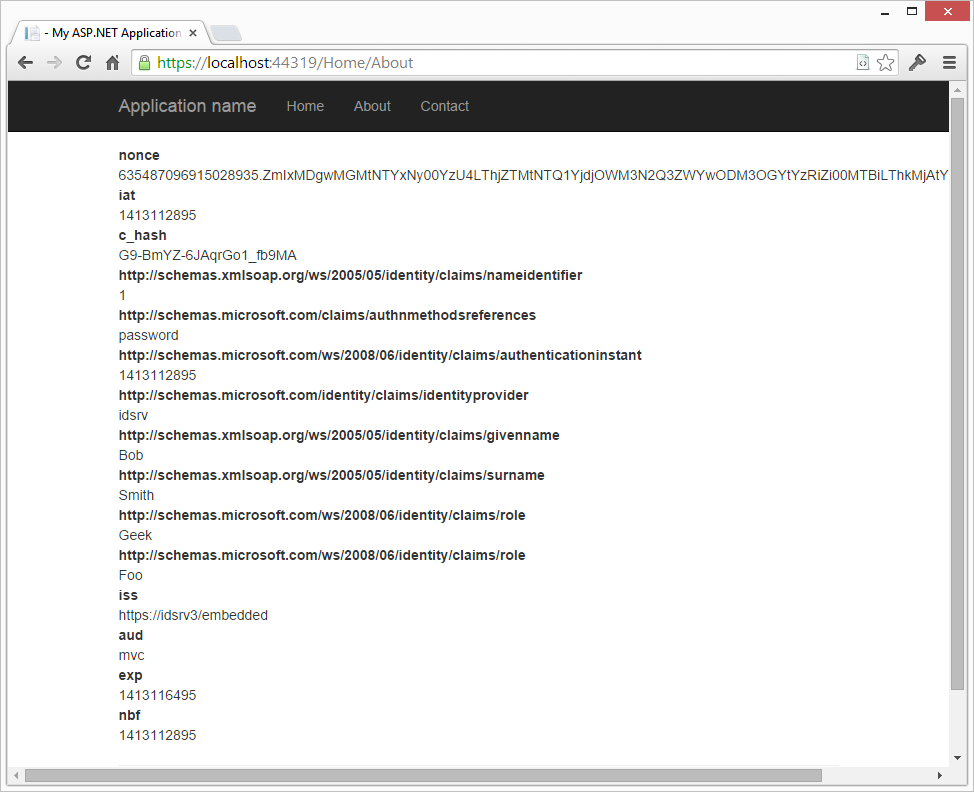

__声明转换__

当您检查 about页面上的声明时，您将注意到两件事,1.一些声明有奇数的长类型名称，并且有比您的应用程序中可能需要的更多的声明。
长声明名称来自Microsoft的JWT处理程序，该处理程序试图将某些声明类型映射到.NET的ClaimTypes类类型。您可以使用以下代码行（在启动时）关闭此行为。

这也意味着您需要将抗CSRF保护的配置调整为新的唯一子声明类型：
```
AntiForgeryConfig.UniqueClaimTypeIdentifier = Constants.ClaimTypes.Subject;
JwtSecurityTokenHandler.InboundClaimTypeMap = new Dictionary<string, string>();
```
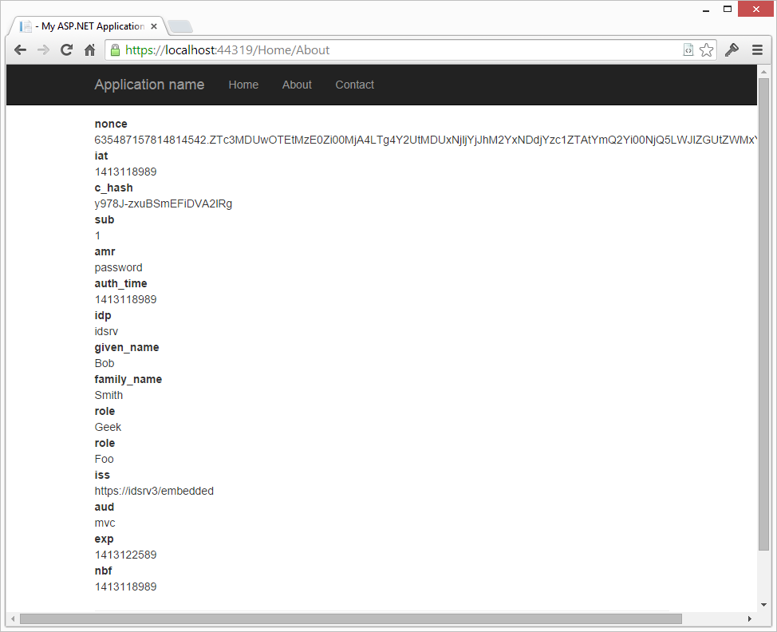

这只是一个改进，但仍然有一些低级协议声明,这肯定不是典型业务逻辑所需要的。将原始传入的声明转换为特定应用程序的声明过程 称为声明转换。在此过程中，您将获取传入的声明，决定要保留哪些声明，并且可能需要联系其他数据存储以检索应用程序所需的更多声明。

OIDC 中间件有一个通知，您可以使用它来进行声明转换-生成的声明将存储在Cookie中

```
app.UseOpenIdConnectAuthentication(new OpenIdConnectAuthenticationOptions
{
    Authority = "https://localhost:44319/identity",

    ClientId = "mvc",
    Scope = "openid profile roles",
    RedirectUri = "https://localhost:44319/",
    ResponseType = "id_token",

    SignInAsAuthenticationType = "Cookies",
    UseTokenLifetime = false,

    Notifications = new OpenIdConnectAuthenticationNotifications
    {
        SecurityTokenValidated = n =>
            {
                var id = n.AuthenticationTicket.Identity;

                // we want to keep first name, last name, subject and roles
                var givenName = id.FindFirst(Constants.ClaimTypes.GivenName);
                var familyName = id.FindFirst(Constants.ClaimTypes.FamilyName);
                var sub = id.FindFirst(Constants.ClaimTypes.Subject);
                var roles = id.FindAll(Constants.ClaimTypes.Role);

                // create new identity and set name and role claim type
                var nid = new ClaimsIdentity(
                    id.AuthenticationType,
                    Constants.ClaimTypes.GivenName,
                    Constants.ClaimTypes.Role);

                nid.AddClaim(givenName);
                nid.AddClaim(familyName);
                nid.AddClaim(sub);
                nid.AddClaims(roles);

                // add some other app specific claim
                nid.AddClaim(new Claim("app_specific", "some data"));                   

                n.AuthenticationTicket = new AuthenticationTicket(
                    nid,
                    n.AuthenticationTicket.Properties);

                return Task.FromResult(0);    
            }
    }
});
```

添加上面的代码，我们的声明现在看起来如下

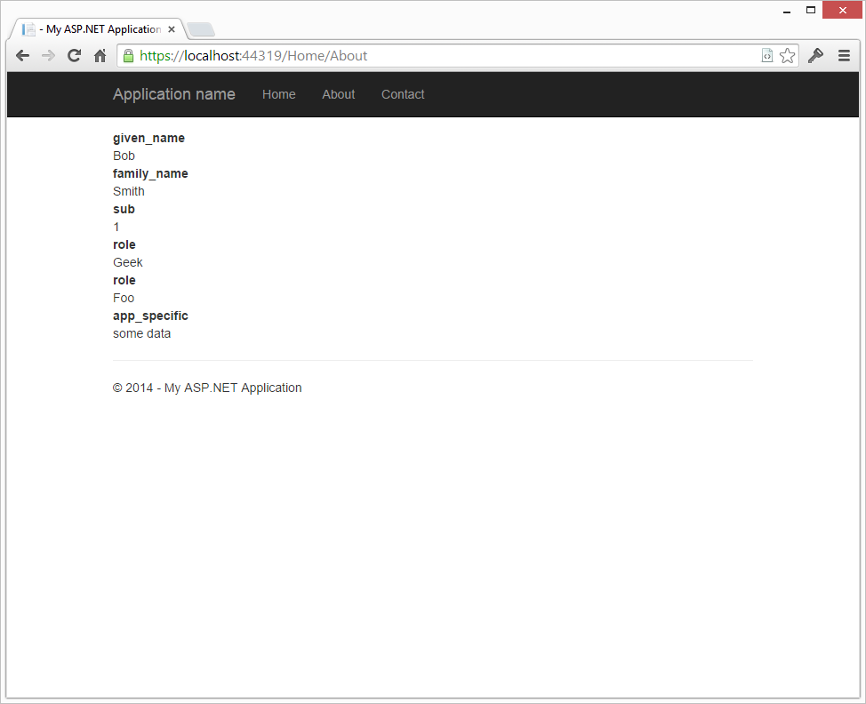

#### 授权

现在我们有了身份验证和一些声明，可以开始添加简单的授权规则

MVC 有一个名为[Authorize]的内置属性来要求经过身份验证的用户，您还可以使用该属性来注释角色成员资格要求。
我们不建议使用这种方法，因为这通常会导致混合业务/控制器逻辑和授权策略等关注点代码。我们建议将授权逻辑从控制器中分离出来，这样可以获得更干净的代码和更好的可测试性

__资源授权__

要添加新的授权基础结构和新属性，我们添加一个包
```
install-package Thinktecture.IdentityModel.Owin.ResourceAuthorization.Mvc
```
接下来，我们用一个属性注释控制器上的 Contact Action,该属性表示执行该操作将读取 ContractDetail 资源

```
[ResourceAuthorize("Read", "ContactDetails")]
public ActionResult Contact()
{
    ViewBag.Message = "Your contact page.";

    return View();
}
```

请注意，该属性并不表示允许谁读取联系人-我们将该逻辑分离为一个授权管理器，该管理器知道操作、资源以及允许谁在应用程序中执行哪些操作：

```
public class AuthorizationManager : ResourceAuthorizationManager
{
    public override Task<bool> CheckAccessAsync(ResourceAuthorizationContext context)
    {
        switch (context.Resource.First().Value)
        {
            case "ContactDetails":
                return AuthorizeContactDetails(context);
            default:
                return Nok();
        }
    }

    private Task<bool> AuthorizeContactDetails(ResourceAuthorizationContext context)
    {
        switch (context.Action.First().Value)
        {
            case "Read":
                return Eval(context.Principal.HasClaim("role", "Geek"));
            case "Write":
                return Eval(context.Principal.HasClaim("role", "Operator"));
            default:
                return Nok();
        }
    }
}
```
最后，我们在启动时将授权管理器连接到OWIN管道：
```
app.UseResourceAuthorization(new AuthorizationManager());
```

__角色授权__

但是，如果您选择使用[Authorize（Roles=“Foo，Bar”）]请注意，当当前用户通过身份验证时，站点可以被抛出到无限重定向循环中，但不属于您传递到Authorize属性（在MVC 5.2中验证）的角色或用户之一。出现这种不希望的结果是因为Authorize属性将在对用户进行身份验证时（而不是在其中一个角色中）将操作的结果设置为401 unauthorized。401结果触发一个重定向以使用IdentityServer进行身份验证，该重定向验证用户，然后重定向回用户，然后重定向循环开始。通过如下重写Authorize属性的HandleUnauthorizedRequest方法，然后使用自定义的authorization属性而不是MVC附带的属性，可以克服此行为。

```
// Customized authorization attribute:
public class AuthAttribute : AuthorizeAttribute
{
    protected override void HandleUnauthorizedRequest(AuthorizationContext filterContext)
    {
        if (filterContext.HttpContext.User.Identity.IsAuthenticated)
        {
            // 403 we know who you are, but you haven't been granted access
            filterContext.Result = new HttpStatusCodeResult(System.Net.HttpStatusCode.Forbidden);
        }
        else
        {
            // 401 who are you? go login and then try again
            filterContext.Result = new HttpUnauthorizedResult();
        }
    }
}

// Usage:
[Auth(Roles = "Geek")]
public ActionResult About()
{
    // ...
}
```

__更多授权和处理拒绝访问的情况__

让我们通过向主控制器添加新的操作方法来执行更多的授权：

```
[ResourceAuthorize("Write", "ContactDetails")]
public ActionResult UpdateContact()
{
    ViewBag.Message = "Update your contact details!";

    return View();
}
```
当您试图通过导航到/home/updatecontact URL来调用该操作时，您将看到一个禁止的错误页面。
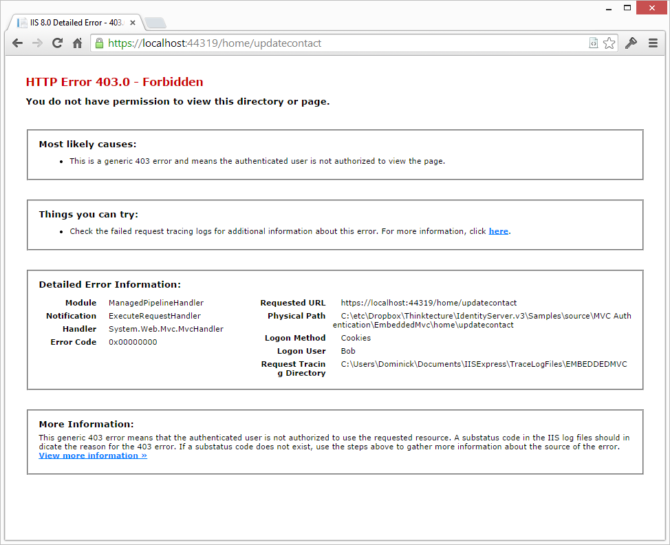

实际上，如果用户已经通过身份验证或没有通过身份验证，您将看到基于此事实的不同响应。如果没有，MVC将重定向到登录页面，如果经过身份验证，您将看到禁止的响应。这是设计的（在这里阅读更多内容）。

您可以通过检查403个状态码来处理禁止条件-我们提供了一个开箱即用的过滤器：
```
[ResourceAuthorize("Write", "ContactDetails")]
[HandleForbidden]
public ActionResult UpdateContact()
{
    ViewBag.Message = "Update your contact details!";

    return View();
}
```
HandleForbidden过滤器（当然也可以是全局的）将在403发出时重定向到指定的视图-默认情况下，我们会查找一个名为Forbidden的视图。

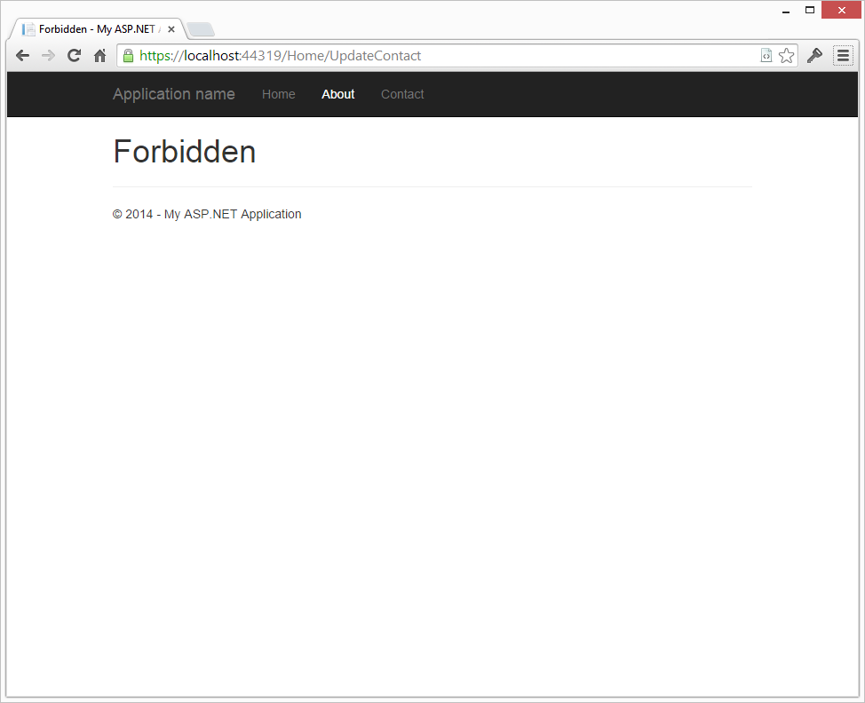

您还可以强制使用授权管理器，它为您提供了更多选项：
```
[HandleForbidden]
public ActionResult UpdateContact()
{
    if (!HttpContext.CheckAccess("Write", "ContactDetails", "some more data"))
    {
        // either 401 or 403 based on authentication state
        return this.AccessDenied();
    }

    ViewBag.Message = "Update your contact details!";
    return View();
}
```

__添加登出__

添加注销很简单，只需在Katana身份验证管理器中添加一个调用注销方法的新操作：
```
public ActionResult Logout()
{
    Request.GetOwinContext().Authentication.SignOut();
    return Redirect("/");
}
```
这将启动到IdentityServer上所谓的endsession端点的往返。此终结点将清除身份验证cookie并终止会话：
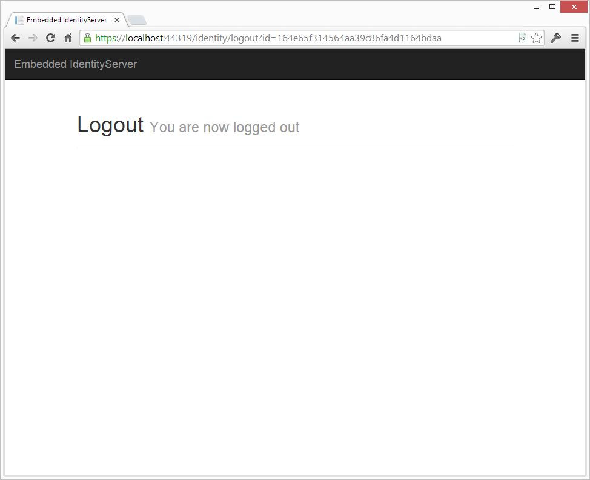

通常，现在最安全的做法是关闭浏览器窗口以删除所有会话数据。但有些应用程序希望给用户一个以匿名用户身份返回的机会。

这是可能的，但需要一些步骤-首先，您需要注册一个有效的URL，以便在注销过程完成后返回。这是在MVC应用程序的客户端定义中完成的（请注意新的PostLogoutRedirectouris设置）：

```
new Client
{
    Enabled = true,
    ClientName = "MVC Client",
    ClientId = "mvc",
    Flow = Flows.Implicit,

    RedirectUris = new List<string>
    {
        "https://localhost:44319/"
    },
    PostLogoutRedirectUris = new List<string>
    {
        "https://localhost:44319/"
    }
}
```

接下来，客户端必须向注销端点证明其身份，以确保我们重定向到正确的URL（而不是某些垃圾邮件发送者/仿冒网页）。这是通过将客户端在身份验证过程中接收到的初始身份令牌发送回来完成的。到目前为止，我们已经放弃了这个令牌，现在是时候更改声明转换逻辑来保留它了。

这是通过将这行代码添加到SecurityTokenValidated通知来完成的：
```
// keep the id_token for logout
nid.AddClaim(new Claim("id_token", n.ProtocolMessage.IdToken));
```
最后一步，我们必须在用户注销时附加id_token，然后往返于IdentityServer。这也可以使用OIDC中间件上的通知来完成：
```
RedirectToIdentityProvider = n =>
{
    if (n.ProtocolMessage.RequestType == OpenIdConnectRequestType.LogoutRequest)
    {
        var idTokenHint = n.OwinContext.Authentication.User.FindFirst("id_token");

        if (idTokenHint != null)
        {
            n.ProtocolMessage.IdTokenHint = idTokenHint.Value;
        }
    }

    return Task.FromResult(0);
}
```

### 添加并且调用 WebApi
