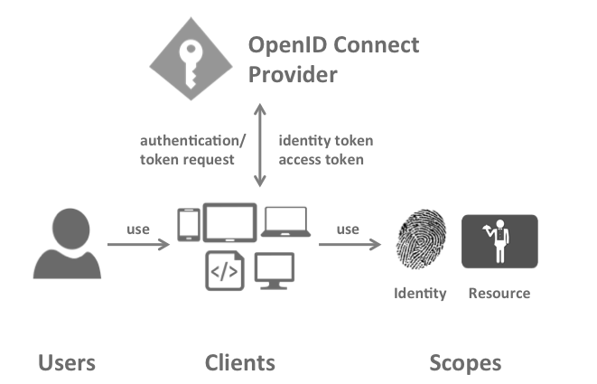

### 术语

规范、文档和对象模型使用某些术语，这些术语您应该了解

1. `OpenId Connect 提供程序`(`OP`)

`IdentityServer` 是一个 OpenId Connect 提供程序,它实现了OpenID Connect 协议 与 OAuth2协议

不同的文献对同一个角色有不同的说明,您可能找到`安全令牌服务`,`身份提供程序`,`授权服务器`，`IP-STS`等

但是他们都是一样的，一款向客户机发布安全令牌的软件。

`Identity Server` 包含许多作业与功能:

1.1 使用本地账户存储或者外部身份提供程序(提供账户数据) 对用户进行身份验证

1.2 提供会话管理(Session Management) 和 单点登录

1.3 管理与验证客户端

1.4 向客户端颁发身份与访问令牌

1.5 验证令牌

2. `Client` 客户端

客户端是一个软件，它从 `Identity Server` 请求令牌 用于验证用户或者访问资源，客户端必须在 `OP`注册

客户端的实例有 Web应用程序，本地程序，桌面应用程序,服务器进程等

3. `User` 用户

用户是使用注册客户机 访问受保护资源数据(Resource webapi等)的人员

4. `Scope` 范围

作用域是客户端要访问的资源的标识符，此标识符在身份验证或令牌请求期间发送到 `OP`
默认情况下，允许每个客户端为每个作用域请求令牌，但您可以对其进行限制

5. `Identity Scope` 标识作用域

请求有关用户的身份信息(aka claims),比如(用户的姓名,用户的邮件地址 作为OpenID Connect的一个作用域)

例如,有一个 `profile` 的 Scope(范围),其中包括 (姓名，姓氏,首选用户名，性别，简历图片)等,你可以阅读到标准作用域的内容，
并且可以在 `Identity Server` 中创建自己的作用域来为自己的需求建模

6. `Resource Scopes` 资源范围

资源范围标识`Web Apis`（也叫资源服务器），例如可以有一个名为 `calendar`的作用域,该作用域表示日历API

7. 身份验证与令牌请求

客户端从 `OP` 请求令牌,根据请求的作用域,OP将返回一个标识令牌、一个访问令牌活两者都返回

8. `Identity Token` 身份令牌

一个身份令牌表示身份验证过程的结果，它至少包含用户的标识符(called the sub aka subject claim),它可以包含
有关用户的附加信息，以及有关用户如何在OP上进行身份验证的详细信息

9. `Access Token` 访问令牌

访问令牌允许访问资源，客户端请求访问令牌并将其转发到Api,访问令牌包含有关客户端和用户(如果存在)的信息。
Api使用这些信息来授权对其数据的访问
