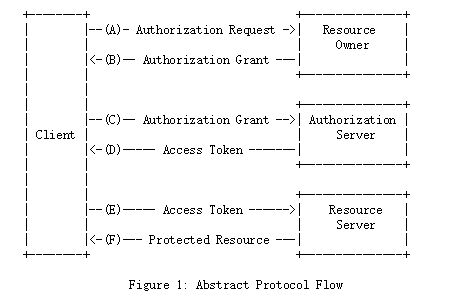
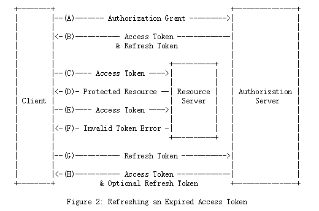
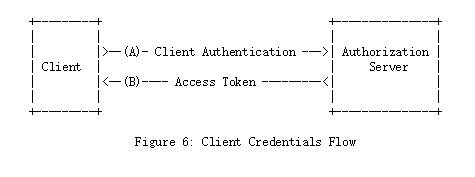

### OAuth2.0讲解

1. OAuth的一些基本概念

1.1 OAuth定义四个角色

`资源所有者(resource owner)`: 能够授予对受保护资源的访问权限的实体.当资源所有者是一个人时，它被称为最终用户.
`资源服务器(resource server)`: 托管受保护资源的服务器,能够接受并使用访问令牌响应受保护的资源请求.
`客户(client)`: 代表该服务器创建受保护资源请求的应用程序，资源所有者及其授权."客户"这个词的确如此,
并不意味着任何特定的实施特征(例如,应用程序是在服务器,桌面还是其他服务器上执行设备).
`授权服务器(authorization server)`: 服务器成功向客户端发出访问令牌验证资源所有者并获得授权.

1.2 客户端注册服务器

OAuth 2.0服务都要求您首先注册一个新应用程序，这通常还要求您首先注册为该服务的开发人员.
注册过程通常涉及在服务的网站上创建一个帐户，然后输入有关应用程序的基本信息，如名称，网站，徽标等。
注册申请后，您将获得client_id（client_secret在某些情况下）当您的应用与服务互动时，您将使用它。

1.3 访问令牌范围 `scope`

2. 常用的使用模式

2.1 认证服务器与资源服务器集成,客户端自带`clientId`与`clientsecret`

