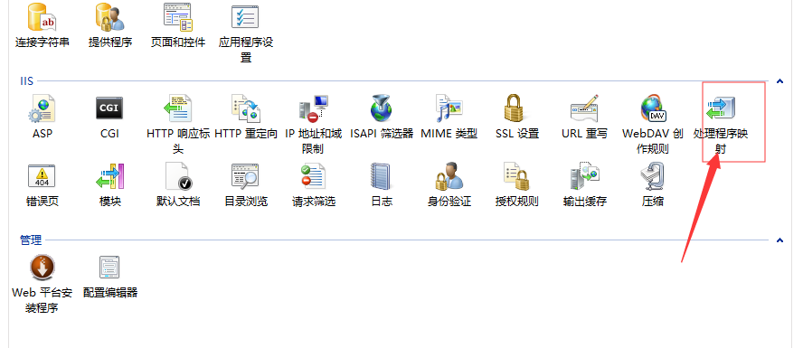
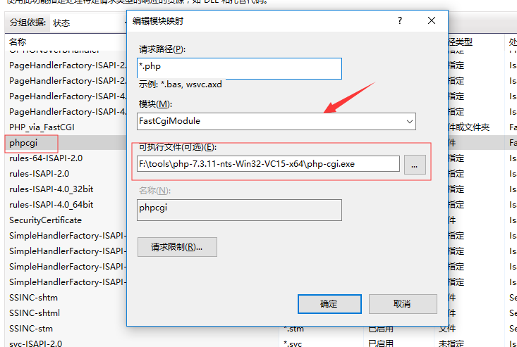
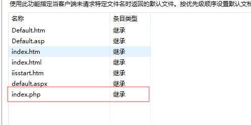
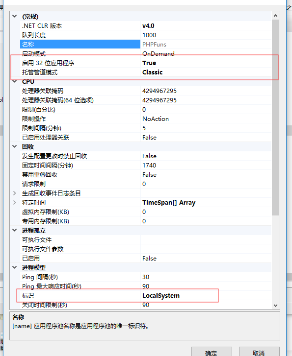
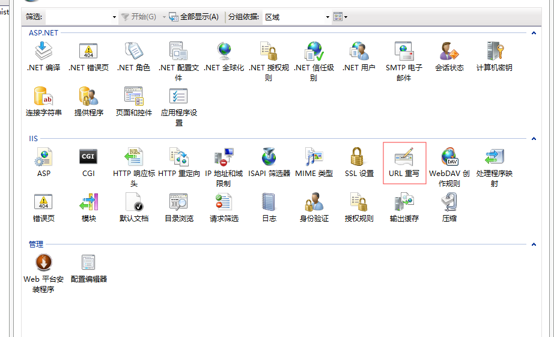
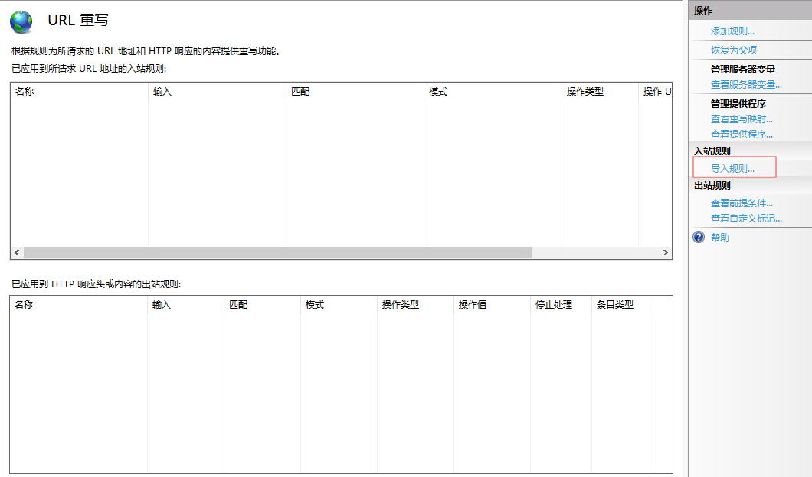

### PHP学习

1. 使用 `Visual Studio 2017` + `PHP_Tools_For_Visual_Studio`[破解版](../Tools/PHP_Tools_for_Visual_Studio破解版.tar)

2. IIS 上配置 PHP 项目站点

2.1 配置处理程序映射



2.2 设置详细的处理程序映射



2.3 设置站点默认页面



2.4 配置对应的应用程序池属性



3. 查看`PHP`的配置文件信息，`phpinfo()` 中 `Loaded Configuration File` 为 `none`的情况

```
//windows 中进入 cmd
php -i | findstr php.ini
```
如果还没有解决，请  建立系统变量 PHPRC，值为php.ini所在目录路径


4. 国产的一些PHP框架

4.1 [SpeedPHP](https://www.speedphp.com/forum.php)  新手入门

4.2 [G-Framework](http://www.g-framework.com)

4.3 [Z-php](https://www.z-php.com) 很整洁

5. 国外很火的

5.1 [Yii](https://www.yiichina.com)
5.2 [CodeIgniter](http://codeigniter.org.cn/)
5.3 [CakePHP](https://cakephp.org/)
5.4 [Akelos]()
5.5 [Symfony](http://symfonychina.com/doc/current/index.html)
5.6 [Prado](http://www.pradoframework.net/site/)
5.7 [Zend](https://www.phpfans.net/manu/ZF/index1.html)
5.8 [QPHP]()
6. IIS 如何支持 Apache中的 `.htaccess` 文件

6.1 可以使用`IIS 的 URLRewrite` 来导入 `.htaccess`





7. Visual Studio 进行调试需要

1. 安装 `PHP tools for visual studio`,安装完后 VisualStudio->工具-》选项-》PHP Tools-》Interpreter-》PHP Path等设置

2. 需要使用visual studio 2015调试php程序还得配置php.ini和安装xdebug插件,修改php.ini文件
在文件中加入一下代码

[Xdebug]
zend_extension_ts = "c:/php/ext/php_xdebug.dll"

xdebug.collect_params=On
xdebug.collect_return=On
xdebug.trace_output_dir="F:\phpweb\xdebug" //设定函数调用监测信息的输出文件的路径。
xdebug.profiler_output_dir="F:\phpweb\xdebug" //设定效能监测信息输出文件的路径。

如果没有php_xdebug.dll dll 则需要去http://www.xdebug.org/download.php下载一个最新版的，然后放在php的安装目录下的ext目录下.

配置好后重启apche再去phpinfo中查看是否包含了xdebug
