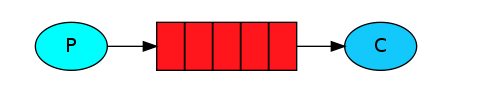
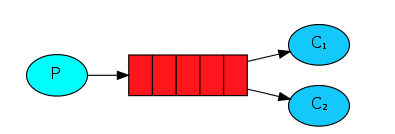
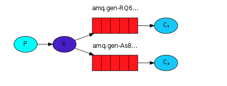
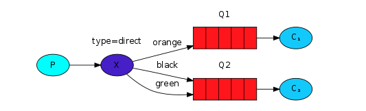
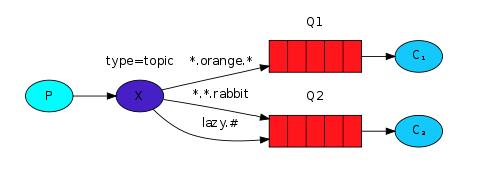

> RabbitMQ 了解与深入

1. [AMQP-协议文档](images/amqp-协议文档.pdf)

> RabbitMQ 的命令操作

1. 安装 `Erlang` ,配置 `ERLANG_HOME`变量

2. 把 `RabbitMQ`安装位置的 `sbin` 加入到环境变量中

```
//开启
rabbitmq-plugins enable rabbitmq_management
```

3. 可以访问 `http://127.0.0.1:15672/` 用户名与密码默认都是 guest

> RabbitMQ 常见的几种使用模式

* __Simple Queue(简单队列模式)__



* __Work Queues(工作队列模式)__



* __Publish/Subscribe(发布与订阅模式)__



* __Routing(路由模式)__



* __Topic(主题模式)__



> RabbitMQ 使用场景


> RabbitMQ 交换机类型


* Direct: 消息通过`routing key`与`binding key` 完全匹配进行转发到队列中。
* Fanout: 交换机把消息转发到绑定的所有队列中。
* Topic: 交换机根据`routing key` 与 `binding key` 进行模式匹配转发到队列中。
* Headers: 交换机根据消息的头部属性进行转发到匹配的绑定队列中。

> RabbitMQ 消息发送流程


> RabbitMQ 中的一些概念

* `Producer`: 发送消息的应用程序
* `Consumer`: 接受消息的应用程序
* `Queue`: 缓存或存储消息
* `Message`: 消息（发送者或者消费者沟通的东东）
* `Connection`: TCP 连接应用程序与 RabbitMQ 实例节点
* `Channel`: 连接中的一个虚拟连接
* `Exchange`: 交换机,接受所有生产者发送过来的消息
* `Binding`: 绑定，队列与交换机之间的一个连接
* `Routing Key`: 发送消息的时候使用的 路由Key,结合交换机类型 决定交换机转发消息到哪个队列上
* `AMQP`: 高级消息队列协议
* `Users`: RabbitMQ 服务器端设置的用户，用户包含权限
* `Vhost,virtual host`: 提供一种方式分隔不同的应用程序使用同一个RabbitMQ 实例。
