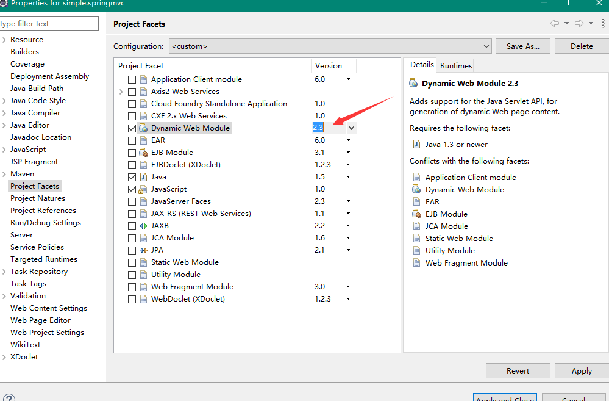
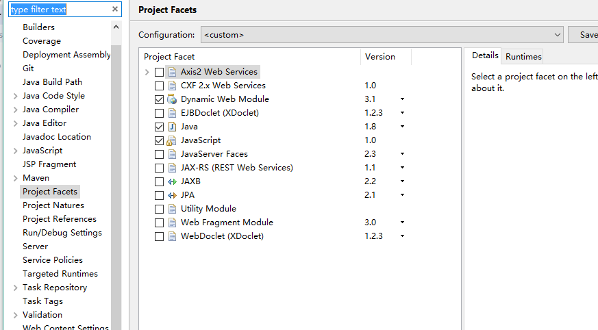
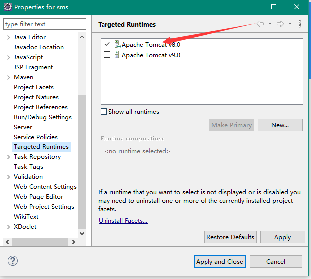

#### Maven默认创建的项目是 DynamicWebModule 2.*

1. `2.*` 版本使用的是

```
<!--2.3版本的servlet-api-->
<dependency>
    <groupId>javax.servlet</groupId>
    <artifactId>servlet-api</artifactId>
    <version>2.3</version>
    <scope>provided</scope>
</dependency>
```

```
//web.xml 对应的标记
<!DOCTYPE web-app PUBLIC
 "-//Sun Microsystems, Inc.//DTD Web Application 2.3//EN"
 "http://java.sun.com/dtd/web-app_2_3.dtd" >

<web-app>
  <display-name>bestkfshop</display-name>
</web-app>
```

```
Navigator 视图下打开的 .setttings 目录下的  org.eclipse.wst.common.project.facet.core.xml
<?xml version="1.0" encoding="UTF-8"?>
<faceted-project>
  <fixed facet="wst.jsdt.web"/>
  <installed facet="java" version="1.5"/>
  <installed facet="jst.web" version="2.3"/>
  <installed facet="wst.jsdt.web" version="1.0"/>
</faceted-project>
```
右键项目 `properties` -> `Project Facets`



2. 3.* 版本

```
<!--3.1版本的servlet-api-->
<dependency>
    <groupId>javax.servlet</groupId>
    <artifactId>javax.servlet-api</artifactId>
    <version>3.1.0</version>
    <scope>provided</scope>
</dependency>
```

```
//web.xml对应的标记内容
<web-app xmlns="http://xmlns.jcp.org/xml/ns/javaee"
  xmlns:xsi="http://www.w3.org/2001/XMLSchema-instance"
  xsi:schemaLocation="http://xmlns.jcp.org/xml/ns/javaee
                      http://xmlns.jcp.org/xml/ns/javaee/web-app_3_1.xsd"
  version="3.1"
  metadata-complete="true">
  <display-name>bestkfshop</display-name>
  <description>simple web project</description>
</web-app>
```

```
//Navigator 视图下打开的 .setttings 目录下的  org.eclipse.wst.common.project.facet.core.xml
<?xml version="1.0" encoding="UTF-8"?>
<faceted-project>
  <runtime name="Apache Tomcat v8.0"/>
  <fixed facet="wst.jsdt.web"/>
  <installed facet="java" version="1.8"/>
  <installed facet="jst.web" version="3.1"/>
  <installed facet="wst.jsdt.web" version="1.0"/>
</faceted-project>
```



3. 如果项目还是出现 红叉，可以


