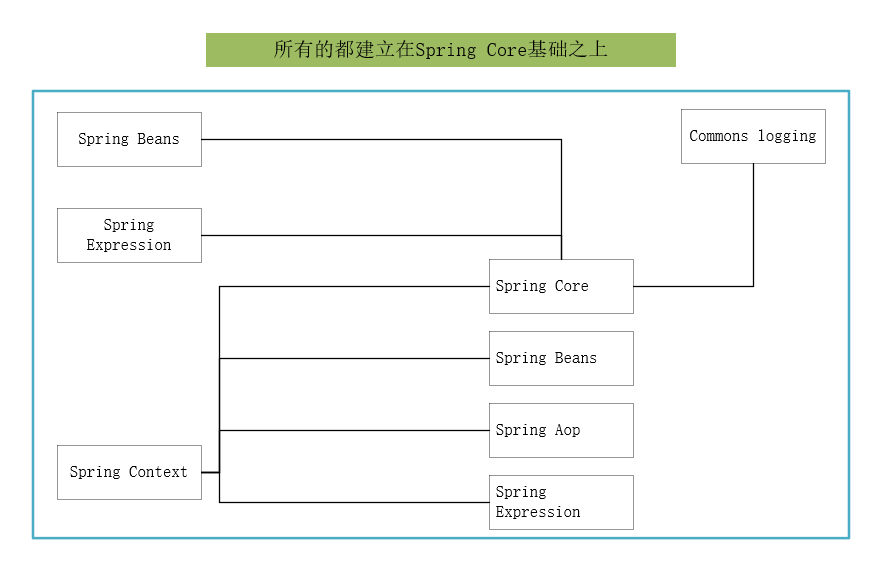

#### 搭建Spring-MVC项目框架

1.  `Spring`中包之间的依赖关系



所以当建Spring MVC项目的时候

```
<properties>
		<junit.version>4.13</junit.version>
		<servlet.version>3.1.0</servlet.version>
		<jstl.version>1.2</jstl.version>
		<spring.version>4.3.27.RELEASE</spring.version>
		<mybatis.version>3.5.5</mybatis.version>
		<mybatisspring.version>2.0.5</mybatisspring.version>
		<mysqlconnector.version>5.1.49</mysqlconnector.version>
		<druid.version>1.1.22</druid.version>
		<commonlogging.version>1.2</commonlogging.version>
		<log4j.version>2.13.3</log4j.version>
		<fastjson.version>1.2.71</fastjson.version>
		<fileupload.version>1.4</fileupload.version>
	</properties>
	<dependencies>
	   <!--单元测试 -->
		<dependency>
			<groupId>junit</groupId>
			<artifactId>junit</artifactId>
			<version>${junit.version}</version>
			<scope>test</scope>
		</dependency>
		<!--jsp方面 -->
		<dependency>
			<groupId>javax.servlet</groupId>
			<artifactId>jstl</artifactId>
			<version>${jstl.version}</version>
		</dependency>
		<dependency>
			<groupId>javax.servlet</groupId>
    		<artifactId>javax.servlet-api</artifactId>
			<version>${servlet.version}</version>
			<scope>provided</scope>
		</dependency>
		<!--SpringWebMVC方面-->
		<dependency>
		    <groupId>org.springframework</groupId>
		    <artifactId>spring-webmvc</artifactId>
		    <version>${spring.version}</version>
		</dependency>
		<dependency>
		    <groupId>org.springframework</groupId>
		    <artifactId>spring-context-support</artifactId>
		    <version>${spring.version}</version>
		</dependency>
		<!--spring数据库方面 -->
		<dependency>		
	      <groupId>org.springframework</groupId>
	      <artifactId>spring-jdbc</artifactId>
	      <version>${spring.version}</version>
	    </dependency>
	    <dependency>
		    <groupId>org.springframework</groupId>
		    <artifactId>spring-tx</artifactId>
		    <version>${spring.version}</version>
		</dependency>
		<dependency>
		    <groupId>org.springframework</groupId>
		    <artifactId>spring-aspects</artifactId>
		    <version>${spring.version}</version>
		</dependency>
		<!--mybatis方面-->
		<dependency>
		    <groupId>org.mybatis</groupId>
		    <artifactId>mybatis</artifactId>
		    <version>${mybatis.version}</version>
		</dependency>
		<dependency>
		    <groupId>org.mybatis</groupId>
		    <artifactId>mybatis-spring</artifactId>
		    <version>${mybatisspring.version}</version>
		</dependency>
		<dependency>
		    <groupId>mysql</groupId>
		    <artifactId>mysql-connector-java</artifactId>
		    <version>${mysqlconnector.version}</version>
		</dependency>
		<dependency>
		    <groupId>com.alibaba</groupId>
		    <artifactId>druid</artifactId>
		    <version>${druid.version}</version>
		</dependency>
		<!--日志-->
		<dependency>
		    <groupId>commons-logging</groupId>
		    <artifactId>commons-logging</artifactId>
		    <version>${commonlogging.version}</version>
		</dependency>
		<dependency>
		    <groupId>org.apache.logging.log4j</groupId>
		    <artifactId>log4j-core</artifactId>
		    <version>${log4j.version}</version>
		</dependency>
		<!--Web 上传文件,Json返回等-->
		<dependency>
		    <groupId>com.alibaba</groupId>
		    <artifactId>fastjson</artifactId>
		    <version>${fastjson.version}</version>
		</dependency>
		<dependency>
		    <groupId>commons-fileupload</groupId>
		    <artifactId>commons-fileupload</artifactId>
		    <version>${fileupload.version}</version>
		</dependency>
	</dependencies>
	<build>
		<finalName>bestkf</finalName>
		<plugins>
			<plugin>
				<groupId>org.apache.maven.plugins</groupId>
				<artifactId>maven-compiler-plugin</artifactId>
				<version>2.3.2</version>
				<configuration>
					<source>1.8</source>
					<target>1.8</target>
				</configuration>
			</plugin>
		</plugins>
	</build>
```
