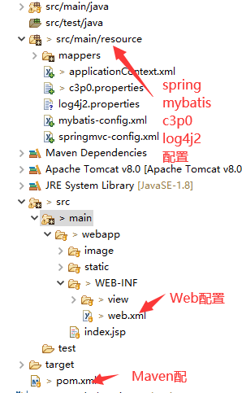

> 项目结构



> 项目文件模板

1. `Pom.xml` 文件

```
<?xml version="1.0" encoding="UTF-8"?>

<project xmlns="http://maven.apache.org/POM/4.0.0" xmlns:xsi="http://www.w3.org/2001/XMLSchema-instance"
         xsi:schemaLocation="http://maven.apache.org/POM/4.0.0 http://maven.apache.org/xsd/maven-4.0.0.xsd">
    <modelVersion>4.0.0</modelVersion>
    <groupId>site.bestkf</groupId>
    <artifactId>sms</artifactId>
    <version>1.0</version>
    <packaging>war</packaging>
    <name>simple ssm web app</name>
    <url>http://www.bestkf.site</url>

    <properties>
        <springmvc.version>5.1.7.RELEASE</springmvc.version>
        <commons-fileupload.version>1.4</commons-fileupload.version>
        <jackson-databind.version>2.9.10</jackson-databind.version>
        <spring-jdbc.version>5.1.7.RELEASE</spring-jdbc.version>
        <mybaits.version>3.5.1</mybaits.version>
        <pagehelper.version>5.1.9</pagehelper.version>
        <mybatis-spring.version>2.0.1</mybatis-spring.version>
        <javax.servlet-api.version>3.1.0</javax.servlet-api.version>
        <jstl.version>1.2</jstl.version>
        <mysql-connector-java.version>8.0.16</mysql-connector-java.version>
        <c3p0.version>0.9.5.4</c3p0.version>
        <commons-logging.version>1.2</commons-logging.version>
        <log4j2.version>2.12.1</log4j2.version>
        <compiler.source>1.8</compiler.source>
        <compiler.target>1.8</compiler.target>
    </properties>

    <dependencies>
        <!-- spring mvc -->
        <dependency>
            <groupId>org.springframework</groupId>
            <artifactId>spring-webmvc</artifactId>
            <version>${springmvc.version}</version>
        </dependency>
        <!-- Spring mvc:JSON -->
        <dependency>
            <groupId>com.fasterxml.jackson.core</groupId>
            <artifactId>jackson-databind</artifactId>
            <version>${jackson-databind.version}</version>
        </dependency>
        <!-- Spring mvc:file -->
        <dependency>
            <groupId>commons-fileupload</groupId>
            <artifactId>commons-fileupload</artifactId>
            <version>${commons-fileupload.version}</version>
        </dependency>
        <!-- Spring JDBC -->
        <dependency>
            <groupId>org.springframework</groupId>
            <artifactId>spring-jdbc</artifactId>
            <version>${spring-jdbc.version}</version>
        </dependency>
        <!-- MyBatis -->
        <dependency>
            <groupId>org.mybatis</groupId>
            <artifactId>mybatis</artifactId>
            <version>${mybaits.version}</version>
        </dependency>
        <!-- MyBatis 分页插件 -->
        <dependency>
            <groupId>com.github.pagehelper</groupId>
            <artifactId>pagehelper</artifactId>
            <version>${pagehelper.version}</version>
        </dependency>
        <!-- Mybatis与Spring的整合包 -->
        <dependency>
            <groupId>org.mybatis</groupId>
            <artifactId>mybatis-spring</artifactId>
            <version>${mybatis-spring.version}</version>
        </dependency>
        <!-- Servelt API -->
        <dependency>
            <groupId>javax.servlet</groupId>
            <artifactId>javax.servlet-api</artifactId>
            <version>${javax.servlet-api.version}</version>
            <scope>provided</scope>
        </dependency>
        <!-- JSTL -->
        <dependency>
            <groupId>javax.servlet</groupId>
            <artifactId>jstl</artifactId>
            <version>${jstl.version}</version>
        </dependency>
        <!-- 数据库驱动 -->
        <dependency>
            <groupId>mysql</groupId>
            <artifactId>mysql-connector-java</artifactId>
            <version>${mysql-connector-java.version}</version>
        </dependency>
        <!-- 数据库连接池 -->
        <dependency>
            <groupId>com.mchange</groupId>
            <artifactId>c3p0</artifactId>
            <version>${c3p0.version}</version>
        </dependency>
        <!-- 日志组件 -->
        <dependency>
            <groupId>commons-logging</groupId>
            <artifactId>commons-logging</artifactId>
            <version>${commons-logging.version}</version>
        </dependency>
        <dependency>
   			<groupId>org.apache.logging.log4j</groupId>
    		<artifactId>log4j-core</artifactId>
		    <version>${log4j2.version}</version>
		</dependency>
		<dependency>
		    <groupId>org.apache.logging.log4j</groupId>
		    <artifactId>log4j-web</artifactId>
		    <version>${log4j2.version}</version>
		</dependency>
    </dependencies>

    <build>
        <finalName>sms</finalName>
        <pluginManagement>
            <plugins>
				<plugin>
					<groupId>org.apache.maven.plugins</groupId>
					<artifactId>maven-compiler-plugin</artifactId>
					<version>2.3.2</version>
					<configuration>
						<source>${compiler.source}</source>
						<target>${compiler.target}</target>
					</configuration>
				</plugin>
            </plugins>
        </pluginManagement>
    </build>
</project>
```

2. `web.xml` 文件

```
<web-app xmlns="http://xmlns.jcp.org/xml/ns/javaee"
  xmlns:xsi="http://www.w3.org/2001/XMLSchema-instance"
  xsi:schemaLocation="http://xmlns.jcp.org/xml/ns/javaee
                      http://xmlns.jcp.org/xml/ns/javaee/web-app_3_1.xsd"
  version="3.1"
  metadata-complete="true">
    <display-name>bestkf.site</display-name>
    <description>simple web app by ssm</description>

    <!-- 启动Spring -->
    <context-param>
        <param-name>contextConfigLocation</param-name>
        <param-value>classpath:applicationContext.xml</param-value>
    </context-param>
    <!-- 启动Spring: 配置加载Spring文件的监听器 -->
    <listener>
        <listener-class>org.springframework.web.context.ContextLoaderListener</listener-class>
    </listener>

    <!-- 指定监听器加载的log4j2配置文件 -->
	<context-param>
        <param-name>log4jConfiguration</param-name>
        <param-value>classpath:log4j2.properties</param-value>
    </context-param>
	<listener>
         <listener-class>org.apache.logging.log4j.web.Log4jServletContextListener</listener-class>
    </listener>

    <!-- 配置Spring MVC编码过滤器 -->
    <filter>
        <filter-name>encoding</filter-name>
        <filter-class>org.springframework.web.filter.CharacterEncodingFilter</filter-class>
        <init-param>
            <param-name>encoding</param-name>
            <param-value>UTF-8</param-value>
        </init-param>
        <init-param>
            <param-name>forceRequestEncoding</param-name>
            <param-value>true</param-value>
        </init-param>
        <init-param>
            <param-name>forceResponseEncoding</param-name>
            <param-value>true</param-value>
        </init-param>
    </filter>
    <filter-mapping>
        <filter-name>encoding</filter-name>
        <url-pattern>/*</url-pattern>
    </filter-mapping>

    <!-- 启动Spring MVC -->
    <servlet>
        <servlet-name>spring_mvc</servlet-name>
        <servlet-class>org.springframework.web.servlet.DispatcherServlet</servlet-class>
        <init-param>
            <param-name>contextConfigLocation</param-name>
            <param-value>classpath:springmvc-config.xml</param-value>
        </init-param>
        <!-- 服务器启动后立即加载Spring MVC配置文件 -->
        <load-on-startup>1</load-on-startup>
    </servlet>
    <servlet-mapping>
        <servlet-name>spring_mvc</servlet-name>
        <url-pattern>/</url-pattern>
    </servlet-mapping>

    <!--欢迎界面-->
    <welcome-file-list>
        <welcome-file>index.jsp</welcome-file>
    </welcome-file-list>
</web-app>
```

3. `springmvc-config.xml` 文件，为 spring mvc 的配置文件

```
<?xml version="1.0" encoding="UTF-8"?>
<beans xmlns="http://www.springframework.org/schema/beans"
       xmlns:xsi="http://www.w3.org/2001/XMLSchema-instance"
       xmlns:context="http://www.springframework.org/schema/context"
       xmlns:mvc="http://www.springframework.org/schema/mvc"
       xsi:schemaLocation="http://www.springframework.org/schema/beans
       http://www.springframework.org/schema/beans/spring-beans.xsd
       http://www.springframework.org/schema/context
       https://www.springframework.org/schema/context/spring-context.xsd
       http://www.springframework.org/schema/mvc
       https://www.springframework.org/schema/mvc/spring-mvc.xsd">

    <description>Spring-MVC configuration file</description>

    <!-- 启用注解扫描器: 扫描被@Controller注解的类 -->
    <context:component-scan base-package="pers.huangyuhui.sms.controller"/>

    <!-- 加载注解驱动 -->
    <mvc:annotation-driven>
      <mvc:message-converters>
	        <bean class="org.springframework.http.converter.StringHttpMessageConverter"/>
	        <bean class="org.springframework.http.converter.ResourceHttpMessageConverter"/>
	        <bean class="org.springframework.http.converter.json.MappingJackson2HttpMessageConverter"/>
	  </mvc:message-converters>
    </mvc:annotation-driven>

    <!-- 处理静态资源 -->
    <mvc:default-servlet-handler/>

    <!-- 配置拦截器 -->
    <mvc:interceptors>
        <mvc:interceptor>
            <mvc:mapping path="/**"/>
            <mvc:exclude-mapping path="/static/h-ui/**"/>
            <mvc:exclude-mapping path="/static/easyui/**"/>
            <mvc:exclude-mapping path="/system/login"/>
            <mvc:exclude-mapping path="/system/getVerifiCodeImage"/>
            <bean class="com.bestkf.interceptors.LoginInterceptor"/>
        </mvc:interceptor>
    </mvc:interceptors>

    <!-- 配置文件上传解析器 -->
    <bean id="multipartResolver" class="org.springframework.web.multipart.commons.CommonsMultipartResolver">
        <!-- 指定请求编码格式 -->
        <property name="defaultEncoding" value="UTF-8"/>
        <!-- 指定指定允许上传文件的最大值(20MB) -->
        <property name="maxUploadSize" value="20971520"/>
    </bean>

    <!-- 配置视图解析器 -->
    <bean class="org.springframework.web.servlet.view.InternalResourceViewResolver">
        <property name="prefix" value="/WEB-INF/view/"/>
        <property name="suffix" value=".jsp"/>
    </bean>
</beans>
```

4. `applicationContext.xml` Spring 的上下文配置文件

```
<?xml version="1.0" encoding="UTF-8"?>
<beans xmlns="http://www.springframework.org/schema/beans"
       xmlns:xsi="http://www.w3.org/2001/XMLSchema-instance"
       xmlns:context="http://www.springframework.org/schema/context" xmlns:tx="http://www.springframework.org/schema/tx"
       xsi:schemaLocation="http://www.springframework.org/schema/beans
       http://www.springframework.org/schema/beans/spring-beans.xsd
       http://www.springframework.org/schema/context
       https://www.springframework.org/schema/context/spring-context.xsd
       http://www.springframework.org/schema/tx
       http://www.springframework.org/schema/tx/spring-tx.xsd">

    <description>Spring configuration file</description>

    <!-- 读取c3p0.properties中的数据库配置信息 -->
    <context:property-placeholder location="classpath:c3p0.properties"/>

    <!-- 配置数据源 -->
    <bean id="dataSource" class="com.mchange.v2.c3p0.ComboPooledDataSource">
        <!-- 数据库驱动 -->
        <property name="driverClass" value="${c3p0.driverClass}"/>
        <!-- 连接数据库的url -->
        <property name="jdbcUrl" value="${c3p0.jdbcUrl}"/>
        <!-- 连接数据库的用户名 -->
        <property name="user" value="${c3p0.user}"/>
        <!-- 连接数据库的密码 -->
        <property name="password" value="${c3p0.password}"/>
        <!-- 初始化连接数 -->
        <property name="initialPoolSize" value="${c3p0.initialPoolSize}"/>
        <!-- 最大连接数 -->
        <property name="maxPoolSize" value="${c3p0.maxPoolSize}"/>
        <!-- 最小连接数 -->
        <property name="minPoolSize" value="${c3p0.minPoolSize}"/>
        <!-- 连接的生存时间 -->
        <property name="maxIdleTime" value="${c3p0.maxIdleTime}"/>
    </bean>

    <!-- 配置Spring事务管理器 -->
    <bean id="transactionManager" class="org.springframework.jdbc.datasource.DataSourceTransactionManager">
        <!-- 原理:控制数据源 -->
        <property name="dataSource" ref="dataSource"/>
    </bean>

    <!-- 开启事务注解扫描 -->
    <tx:annotation-driven transaction-manager="transactionManager"/>

    <!-- MyBatis与Spring整合 -->
    <bean id="sqlSessionFactory" class="org.mybatis.spring.SqlSessionFactoryBean">
        <!-- 注入数据源 -->
        <property name="dataSource" ref="dataSource"/>
        <!-- 指定Mapper映射文件位置 -->
        <property name="mapperLocations" value="classpath:mappers/*.xml"/>
        <!-- 指定MyBatis核心配置文件位置 -->
        <property name="configLocation" value="classpath:mybatis-config.xml"/>
        <!-- 引入插件 -->
        <property name="plugins">
            <array>
                <!-- 引入MyBaits分页插件 -->
                <bean class="com.github.pagehelper.PageInterceptor">
                    <property name="properties">
                        <!-- 指定数据库类型 -->
                        <value>helperDialct=mysql</value>
                    </property>
                </bean>
            </array>
        </property>
    </bean>

    <!-- 开启Mapper接口扫描器: 扫描Dao层 -->
    <bean class="org.mybatis.spring.mapper.MapperScannerConfigurer">
        <property name="basePackage" value="site.bestkf.dao"/>
    </bean>
    <!-- 开启Spring IOC注解扫描器: 扫描Servie层-->
    <context:component-scan base-package="site.bestkf.service"/>
</beans>
```

5. `mybatis-config.xml` mybatis配置文件

```
<?xml version="1.0" encoding="UTF-8" ?>
<!DOCTYPE configuration PUBLIC "-//mybatis.org//DTD Config 3.0//EN" "http://mybatis.org/dtd/mybatis-3-config.dtd">
<configuration>
    <!-- 为sql映射文件中的输入/输出参数设置类型别名 -->
    <typeAliases>
        <package name="site.bestkf.bean"/>
    </typeAliases>
</configuration>
```

6. `c3p0.properties` 文件,c3p0连接池配置文件

```
###### database configuration information ######
c3p0.jdbcUrl=jdbc:mysql://127.0.0.1:3306/ssm_sms?useSSL=false&serverTimezone=UTC&allowPublicKeyRetrieval=true
c3p0.driverClass=com.mysql.cj.jdbc.Driver
c3p0.user=root
c3p0.password=123456
###### C3P0 configuration information ######
c3p0.maxPoolSize=100
c3p0.minPoolSize=1
c3p0.initialPoolSize=5
c3p0.maxIdleTime=1800
```

7. `log4j2.properties` 文件，log4j2 日志配置文件

```
log4j.rootLogger=debug,stdout,info,debug,warn,error

#console
log4j.appender.stdout=org.apache.log4j.ConsoleAppender
log4j.appender.stdout.layout=org.apache.log4j.PatternLayout
log4j.appender.stdout.layout.ConversionPattern= [%d{yyyy-MM-dd HH:mm:ss a}]:%p %l%m%n
#info log
log4j.logger.info=info
log4j.appender.info=org.apache.log4j.DailyRollingFileAppender
log4j.appender.info.DatePattern='_'yyyy-MM-dd'.log'
log4j.appender.info.File=./logs/info.log
log4j.appender.info.Append=true
log4j.appender.info.Threshold=INFO
log4j.appender.info.layout=org.apache.log4j.PatternLayout
log4j.appender.info.layout.ConversionPattern=%d{yyyy-MM-dd HH:mm:ss a} [Thread: %t][ Class:%c >> Method: %l ]%n%p:%m%n
#debug log
log4j.logger.debug=debug
log4j.appender.debug=org.apache.log4j.DailyRollingFileAppender
log4j.appender.debug.DatePattern='_'yyyy-MM-dd'.log'
log4j.appender.debug.File=./logs/debug.log
log4j.appender.debug.Append=true
log4j.appender.debug.Threshold=DEBUG
log4j.appender.debug.layout=org.apache.log4j.PatternLayout
log4j.appender.debug.layout.ConversionPattern=%d{yyyy-MM-dd HH:mm:ss a} [Thread: %t][ Class:%c >> Method: %l ]%n%p:%m%n
#warn log
log4j.logger.warn=warn
log4j.appender.warn=org.apache.log4j.DailyRollingFileAppender
log4j.appender.warn.DatePattern='_'yyyy-MM-dd'.log'
log4j.appender.warn.File=./logs/warn.log
log4j.appender.warn.Append=true
log4j.appender.warn.Threshold=WARN
log4j.appender.warn.layout=org.apache.log4j.PatternLayout
log4j.appender.warn.layout.ConversionPattern=%d{yyyy-MM-dd HH:mm:ss a} [Thread: %t][ Class:%c >> Method: %l ]%n%p:%m%n
#error
log4j.logger.error=error
log4j.appender.error = org.apache.log4j.DailyRollingFileAppender
log4j.appender.error.DatePattern='_'yyyy-MM-dd'.log'
log4j.appender.error.File =./logs/error.log
log4j.appender.error.Append = true
log4j.appender.error.Threshold = ERROR
log4j.appender.error.layout = org.apache.log4j.PatternLayout
log4j.appender.error.layout.ConversionPattern = %d{yyyy-MM-dd HH:mm:ss a} [Thread: %t][ Class:%c >> Method: %l ]%n%p:%m%n
```
