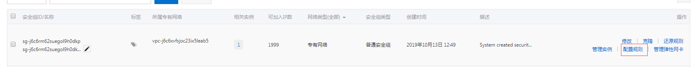
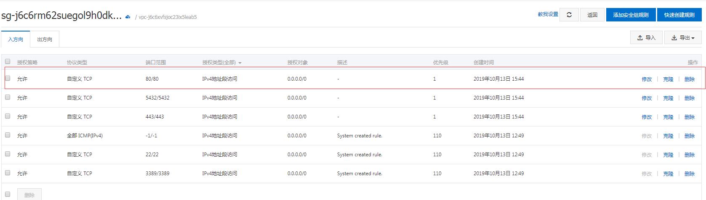

#### WordPress 部署企业站点

1. 下载[WordPress](https://wordpress.org/download/) 这里下载 `WordPress 5.2.3`

2. 安装 `PHP`(需要大于等于7.3版本) ,`MariaDB`(需要大于等于10版本)

```
rpm -Uvh https://dl.fedoraproject.org/pub/epel/epel-release-latest-7.noarch.rpm
rpm -Uvh https://mirror.webtatic.com/yum/el7/webtatic-release.rp

yum install -y php71w php71w-cli php71w-common php71w-devel php71w-embedded php71w-fpm php71w-gd php71w-mbstring php71w-mysqlnd php71w-opcache php71w-pdo php71w-xml

whereis php
```

3. 安装 `Apache` 服务器,如果是阿里的云服务器，得需要




```
yum install lsof -y
yum install httpd* -y
systemctl enable httpd.service
systemctl start httpd.service
```

4. 安装 `MariaDB`

```
yum install -y mariadb-server
systemctl enable mariadb
systemctl start mariadb
mysql_secure_installation
```

4.1 设置数据库管理员步骤
```
#设置密码步骤
Enter current password for root (enter for none):  # 输入数据库超级管理员root的密码(注意不是系统root的密码)，第一次进入还没有设置密码则直接回车

Set root password? [Y/n]  # 设置密码，y

New password:  # 新密码
Re-enter new password:  # 再次输入密码

Remove anonymous users? [Y/n]  # 移除匿名用户， y

Disallow root login remotely? [Y/n]  # 拒绝root远程登录，n，不管y/n，都会拒绝root远程登录

Remove test database and access to it? [Y/n]  # 删除test数据库，y：删除。n：不删除，数据库中会有一个test数据库，一般不需要

Reload privilege tables now? [Y/n]  # 重新加载权限表，y。或者重启服务也许
```

4.2 测试数据库

```
mysql -u root -p
```

4.3 设置`MariaDB`字符集为 `utf-8`

4.3.1 设置 `/etc/my.cnf` 文件

```
#在  [mysqld]  标签下添加
init_connect='SET collation_connection = utf8_unicode_ci'
init_connect='SET NAMES utf8'
character-set-server=utf8
collation-server=utf8_unicode_ci
skip-character-set-client-handshake
```

4.3.2 设置 `/etc/my.cnf.d/client.cnf` 文件

```
#在  [client]  标签下添加
default-character-set=utf8
```

4.3.3 设置 `/etc/my.cnf.d/mysql-clients.cnf` 文件

```
#在  [mysql]  标签下添加
default-character-set=utf8
```
4.3.4 重启 `systemctl restart mariadb`

#### `WordPress`资料网站，[具体的操作文档](wpoperations.md)

1. [WordPress中国](http://wpchina.org/)
