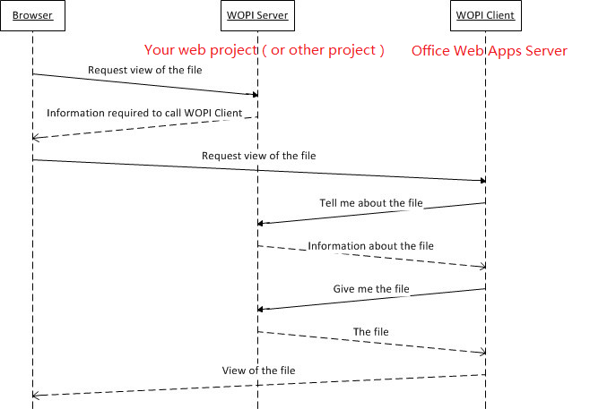

### 工作中的使用工具与东西

1. [PDF.js](https://github.com/mozilla/pdfjs-dist)

后端需要一个读取pdf文件的接口，以流的形式返回给前端

```
byte[] pdfContentBytes = xxxxxx();//pdf的文件字节
return File(pdfContentBytes,"application/pdf"); //MVC的FileActionResult
```

2. 文件使用`UNC`的方式进行共享

```
public class FileNetworkConnection : IDisposable
{
    string UncnetworkName;
    public FileNetworkConnection(string uncnetworkName,
        NetworkCredential credentials)
    {
        UncnetworkName = uncnetworkName;

        var netResource = new NetResource()
        {
            Scope = ResourceScope.GlobalNetwork,
            ResourceType = ResourceType.Disk,
            DisplayType = ResourceDisplaytype.Share,
            RemoteName = UncnetworkName  //可以为： 192.168.111.199\ShareFiles
        };

        var userName = string.IsNullOrEmpty(credentials.Domain)
            ? credentials.UserName
            : string.Format(@"{0}\{1}", credentials.Domain, credentials.UserName);

        var result = WNetAddConnection2(
            netResource,
            credentials.Password,
            userName,
            0);

        if (result != 0)
        {
            throw new Win32Exception(result);
        }   
    }

    ~NetworkConnection()
    {
        Dispose(false);
    }

    public void Dispose()
    {
        Dispose(true);
        GC.SuppressFinalize(this);
    }

    protected virtual void Dispose(bool disposing)
    {
        WNetCancelConnection2(UncnetworkName, 0, false);
    }

    //连接到网络资源
    //NetResource  E结构的指针，它指定了拟议连接的详细信息，例如关于网络资源、本地设备和网络资源提供者的信息。
    //flags:0,临时性链接;1,创建永久性链接
    [DllImport("mpr.dll")]
    private static extern int WNetAddConnection2(NetResource netResource,
        string password, string username, int flags);

    //flags:如为零，而且建立的是永久性连接，则在windows下次重新启动时仍会重新连接
    // 如force为true，表示断开连接（即使连接的资源上正有打开的文件或作业）
    [DllImport("mpr.dll")]
    private static extern int WNetCancelConnection2(string name, int flags,
        bool force);
}

//LayoutKind.Sequential属性让结构体在导出到非托管内存时按出现的顺序依次布局
[StructLayout(LayoutKind.Sequential)]
public class NetResource
{
    public ResourceScope Scope; ////枚举成员的范围 1枚举当前连接的资源 2枚举网络上的所有资源 3枚举（持久）连接
    public ResourceType ResourceType; ////资源的类型  1所有资源 2磁盘资源 3 打印资源
    public ResourceDisplaytype DisplayType; ////网络对象显示选项 显示为域、服务器、共享、文件、组、网络、网络的逻辑根、adminstrshare共享、目录、树、Netware目录服务容器
    public int Usage; ////描述如何使用资源的一组位标志 1资源是可连接的资源 2资源是一个容器资源 3资源不是本地设备 4资源是兄弟姐妹 5必须附加资源
    public string LocalName; //它指定了本地设备的名称。如果连接不使用设备，该成员为NULL
    public string RemoteName;//网络名称
    public string Comment; //该字符串包含由网络提供程序提供的注释
    public string Provider;//该字符串包含拥有该资源的提供者的名称。如果提供者名称未知，该成员可以为NUL
}

public enum ResourceScope : int
{
    Connected = 1,
    GlobalNetwork,
    Remembered,
    Recent,
    Context
};

public enum ResourceType : int
{
    Any = 0,
    Disk = 1,
    Print = 2,
    Reserved = 8,
}

public enum ResourceDisplaytype : int
{
    Generic = 0x0,
    Domain = 0x01,
    Server = 0x02,
    Share = 0x03,
    File = 0x04,
    Group = 0x05,
    Network = 0x06,
    Root = 0x07,
    Shareadmin = 0x08,
    Directory = 0x09,
    Tree = 0x0a,
    Ndscontainer = 0x0b
}

//使用的时候，在程序启动的位置调用
var fileNetworkConnection = new FileNetworkConnection("192.168.111.199\ShareFiles",new NetworkCredential(){
    UserName="bestkf",Password="000000"
});
fileNetworkConnection.Disconnection();
fileNetworkConnection.Connect();
```

3. `Web Office Online` 部署与使用



4. 工作中常用的Linq 做连接域左链接

表 A 与 表 B


```
from a in A
join b in B on a.BId equals b.Id
select new {a.Id, b.Id}
```
结果为{1,1},{2,2},{4,4}

左链接
```
from a in A
join b in B on a.BId equals a.Id
//重点就是into到集合，再DefaultIfEmpty()
into re
from r in re.DefaultIfEmpty()

select new {a.Id, r.Id}
```
结果为{1,1},{2,2},{3,null},{4,4}

右链接，就是把表位置换一下

5. `System.Diagnostics.Debug` 与 `System.Diagnostics.Trace` 使用

`System.Diagnostics.Debug` 主要是在 `Debug` 模式下输出到 Visual Studio IDE 的output窗口, 可以让程序停在 `System.Diagnostics.Debug.assert` 出现错误的地方。发布代码 `Release`版本的时候,所有的 `System.Diagnostics.Debug` 都会无效

6. [SQL优化](Sql.md)

7. [MailKit 发送附件,附件编码问题跟Excel文件变为dat问题，以及文件名长度问题](mailkit.md)
