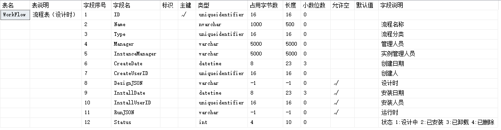

#### `RoadFlow` 工作流引擎分析

##### 程序辅助表设计

1. `AppLibrary`  应用程序库表

功能应用与功能页面记录，一一对应，提供后续的角色应用配置，角色应用配置好后，对应的角色就会渲染对应的应用目录结构。

2. `Dictionary` 数据字典表

为自定义数据提供动态键值对服务,比如唯一代码`AppLibraryTypes`,根据唯一代码可以拉取一个树结构。

3. `DBConnection` 数据库连接表

工作引擎的表单等对应的配置数据来源，尤其是表单设计中的字段设置等,支持多数据库。

4. `Log` 日志表

记录用户的一些重要操作信息,跟往常的日志没有啥区别。

##### 人员与组表设计

1. `Users` 用户表

基础数据表，提供用户基础数据。

2. `UsersInfo` 用户其它信息表

基础数据表，用户的一些个人明细信息。

3. `Role` 角色表

基础数据表,系统的角色定义表。

4. `UsersRole` 用户与角色关系表

基础数据表,用户所拥有的角色信息表。

5. `Organize` 组织机构表

基础数据表,系统定义的正常企业的组织架构(注意:这里的类型定义很有意思,以及它的状态很有扩展性)。
__组织机构表中的信息，不会与任何权限进行挂钩，只与人员的组织结构有关__

6. `UsersRelation` 用户与组织机构关系表

基础数据表,系统定义的企业内，人员与组织架构的关系(注意:是否为主要角色,很有意思)。

7. `WorkGroup` 工作组表

基础数据表,工作组定义，一种特殊的工作方式，对应现实中的以某个业务围绕来搭建工作组。
这种类似于一种灵活的逻辑(另一种意义的组织机构)。
__工作组表中的信息，不会与任何权限进行挂钩，只与人员的组织结构有关__

8. `RoleApp` 角色应用表

基础数据表,目录与子节点(非目录类型的可以关联 AppLibrary应用程序库表中的功能页面)，这里可以自定义目录结构。

9. `UsersApp` 用户个人应用表

基础数据表,在组织下的人员，针对(单个人员添加人员的菜单目录,菜单目录的最后一级节点可以关联 AppLibrary应用程序库表中的功能页面)。

##### 工作流程表设计

1. `WorkFlow` 流程表-设计时

流程定义表，注意(运行时就是安装后的结构，而设计时是仅保存设计时候的数据)，流程状态、实例管理人员、管理人员(设计)

2. `WorkFlowForm` 流程表单表-设计时

表单定义,主要是html结构，事件。

3. `WorkFlowButtons` 流程按钮表

定义按钮的文字，按钮的图片，按钮的样式，以及按钮点击的操作脚本。

4. `WorkFlowComment` 流程处理常用意见表

处理意见定义表，主要是意见的定义，键值对类型。

5. `WorkFlowDelegation` 工作委托表

流程委托表，主要用于当前人处于原因不能亲自处理当前流程业务，需要委托他人进行处理，(委托的开始时间与结束时间比较有意思)

6. `WorkFlowTask` 流程任务表

7. `WorkFlowArchives` 流程归档表

##### 业务表设计(Demo)
