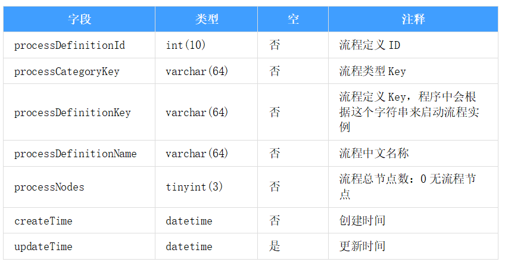

### 工作流设计

1. [简易工作流设计概念基本模型](https://www.jianshu.com/p/fbd4b6d1fbcf)

表设计原则：流程数据和业务数据相分离，这样才能保证工作流引擎的通用性。工作流引擎相关表只负责流程的跳转、走向等。流程中产生的业务表单数据、附件等存储在开发人员定义的业务表中。流程数据和业务数据之间通过processInstanceId(流程实例ID)和业务数据主键相互关联

1.1 `流程类型表`

流程类型表作用的页面直观视图，如下图

1.2 `流程定义表`

流程定义表的作用是保存工作流程的定义，对应的页面直观视图,如下图

1.3 `流程节点名称表`

流程节点名称表作用是每个业务流程节点的中文名称,节点名称可供多个流程节点复用,如下图

1.4 `任务定义表`

任务定义表是流程定义表的字表，存了一个工作流程下的所有节点数据,一个节点可以有多个候选人,如下图

1.5 `流程实例表`

员工请假的是一个审批流程，张三请假是员工请假流程的一个具体实例。流程实例表存了一个工作流程下的所有流程实例,如下图

1.6 `任务实例表`

任务实例表是流程实例表的字表,存了一个流程实例下的每个节点的执行结果,如下图

### 实例分析

1. [RoadFlow 设计分析](RoadFlowAlize.md)
